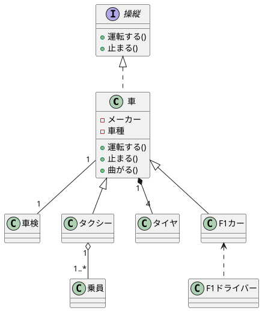
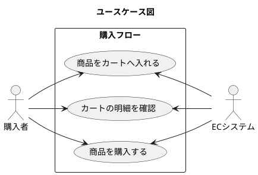
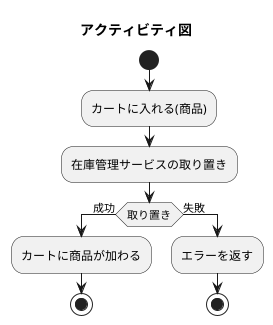
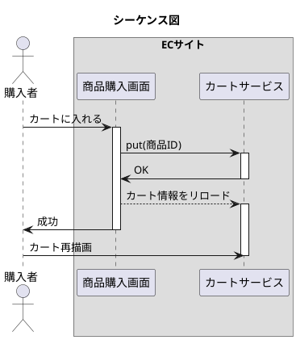
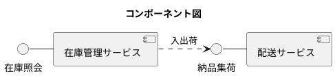
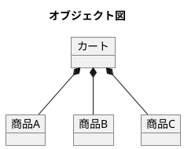
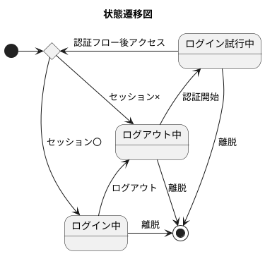

# 基本情報技術者試験　午前語句

※これは個人ための学習用（私的利用目的）です。学習の為使用してしている画像によって、著作権者の利益を不当に害す恐れがあると判断した時点でリポジトリを非公開にします。

<!-- @import "[TOC]" {cmd="toc" depthFrom=2 depthTo=3 orderedList=false} -->

<!-- code_chunk_output -->

- [ストラテジ系](#ストラテジ系)
  - [技術戦略マネジメント](#技術戦略マネジメント)
  - [システム企画](#システム企画)
  - [システム化計画](#システム化計画)
  - [システム戦略](#システム戦略)
  - [経営戦略マネジメント](#経営戦略マネジメント)
  - [ソリューションビジネス](#ソリューションビジネス)
  - [ビジネスシステム](#ビジネスシステム)
  - [ビジネスインダストリ](#ビジネスインダストリ)
  - [企業活動](#企業活動)
  - [法務](#法務)
- [テクノロジ系](#テクノロジ系)
  - [アルゴリズムとプログラミング](#アルゴリズムとプログラミング)
  - [開発プロセス手法](#開発プロセス手法)
  - [基礎理論](#基礎理論)
  - [コンピュータ構成要素](#コンピュータ構成要素)
  - [システム開発技術](#システム開発技術)
  - [システムの構成](#システムの構成)
  - [セキュリティ](#セキュリティ)
  - [ソフトウェア](#ソフトウェア)
  - [ソフトウェア開発管理技術](#ソフトウェア開発管理技術)
  - [データベース](#データベース)
  - [入力装置](#入力装置)
  - [ネットワーク](#ネットワーク)
  - [ハードウェア](#ハードウェア)
  - [ヒューマンインターフェース](#ヒューマンインターフェース)
  - [マルチメディア](#マルチメディア)
- [マネジメント系](#マネジメント系)
  - [サービスマネジメント](#サービスマネジメント)
  - [システム監査](#システム監査)
  - [プロジェクトマネジメント](#プロジェクトマネジメント)

<!-- /code_chunk_output -->

***

## ストラテジ系
### 技術戦略マネジメント
#### 技術のSカーブ
「当初は緩やかに進歩するが、やがて急激に進歩し、成熟期を迎えると進歩は停滞気味になる」という技術進歩の過程のこと。下グラフのように縦軸に技術進歩の度合、横軸に投資した費用や期間とすると、描かれる曲線がS字になることからこのように言われる。

@import "./img/技術のSカーブ.jpg" { width=50% title="技術のSカーブ"}

[引用元：必ず受かる情報処理技術者試験](https://kanauka.com/s/kakomon/ap/h22h/069.html)

#### 技術経営の3つの障壁
魔の川・死の谷・ダーウィンの海と呼ばれる技術経営における3つの障壁のこと。基礎研究から実用化・製品化に向けて応用研究の間に存在する**魔の川**、研究開発の成果が製品化が結び付かない**死の谷**、事業化されてから産業として成立するまでに乗り越えなくてはならない弱肉強食の市場の障壁である**ダーウィンの海**。

### システム企画
#### セキュリティマネジメントの3大要素
次の三つの要素を管理することがセキュリティマネジメントでは大事だとされている。

1. 機密性...許可されたユーザのみアクセスできる
2. 完全性...情報が書き換えられず完全な状態を保つ
3. 可用性...ユーザが必要な時に必要な情報資産を使用することができる

#### セキュリティポリシー
企業として情報セキュリティをどのように取り組むかを明文化して、社内に周知・徹底させること。セキュリティポリシは以下の三層構成をなしている。

1. 基本方針...情報セキュリティに対して企業としての基本方針を定める
2. 対策基準...`1.基本方針` を実現するために行うべき対策や基準を定める
3. 実施基準...業務の中でどのように実施していくか具体的な手順を定める

セキュリティポリシというと基本的には`1. 基本方針`と`2. 対策基準`のことを指す。

#### プライバシーマーク
JIS Q 15001(個人情報保護マネジメントシステム－要求事項)の要求事項を満たし、適切な個人情報保護体制を整備している事業者を認定する制度のこと。

#### システム調達
発注側が開発を担当するシステムベンダに対して発注をかけること。まず発注側が最新の導入事例等の情報を知るために情報提供依頼書（RFI：Request For Information）をシステムベンダに渡す。その情報を元にシステム内容や予算などの諸条件をまとめた提案依頼書(RFP:Request For Proposal)を作成しシステムベンダに渡す。それを受けてシステムベンダは具体的な内容を提案書としてまとめ発注側に渡す。提案内容が可決されると、システムベンダは開発・運用・保守にかかる費用を見積書にまとめ発注側に渡す。発注側は提案内容や見積もりからより条件の良いシステムベンダを選定する。

#### CSR調達
Corporate Social Responsibility
企業活動において経済的成長だけでなく、環境や社会からの要請に対し、責任を果たすことが企業価値の向上につながるという考え方。

#### プライバシーバイデザイン(PBD)
個人情報を取り扱うシステムを構築する際に、上流工程のシステムの企画・設計段階において個人情報を一貫して保護する仕組みを計画、その仕組みを業務プロセスや開発するシステムに組み込む設計思想のこと。

#### ワンタイムパスワード
一度限り有効で使い捨てのパスワードを用いる認証方法。トークンと呼ばれるワンタイムパスワード生成器を使う手法が一般的。銀行とか。

### システム化計画
#### システム化計画の立案
規格プロセスを構成するアクティビティの１つで業務モデルの作成、費用対効果の予測、プロジェクトの目標設定、プロジェクト計画の作成と承認など18のタスクがある。

### システム戦略
#### ディジタルディバイト
情報格差のこと。情報技術を利用する機会や能力のよって産まれる経済的社会的な格差。

#### 情報バリアフリー
社会経済的な格差につながらないように誰もが情報通信を利活用できるように整備された環境のこと。

#### アクセシビリティ
通信機器やソフトウェア、サービスなどが全ての人に利用しやすくなっているかの度合い。

#### BPO
Business Process Outsourcing
自社の業務の一部を、丸ごと外部の業者に委託することです。利点としてコスト削減や業務効率化の効果が期待でき、その企業本来の事業に集中できるようになる。海外業者への外部委託は**オフショアアウトソーシング**と呼ばれる。

#### 総保有コスト TCO
Total cost of ownership
あるシステムに関する導入から廃棄までに必要な時間と支出の総計。
* **イニシャルコスト**…
システム稼働開始のために要する初期費用のこと。ハード購入・設置費用、パッケージソフトの購入費用・開発費、初期教育費などシステムの構築までにかかった費用などが含まれる。
* **ランニングコスト**…
システムの稼働後に生じる維持費用のこと。保守・サポート契約日、ライセンス料、運用人件費、消耗品購入など。

### 経営戦略マネジメント
#### SWOT分析
自社の強みと弱みを分析する手法。自社の現状を強み(Strenngth),弱み(Weakness),機会(Opportunity),脅威(Threat)の要素に分ける。4つの要素は以下のような関係といえる。強みと弱みは人材の質や自社の商品力のことを指すので内部環境に起因するといえる。逆に機会や脅威は市場動向や競合他社等の外部環境に起因するといえる。

||機会|脅威|
|:---:|:---|:---|
|**強み**|<u>積極的攻撃</u><br>自社の強みを活かせる事業機会は？|<u>差別化戦略</u><br>自社の強みによって<br>脅威を回避できる方法は？|
|**弱み**|<u>段階的施策</u><br>自社の弱みによって<br>事業機会を逃さないようにするためには？|<u>専守防衛or撤退</u><br>自社の弱みと脅威によって起こりうる<br>最悪の事態を回避するためには？|

#### 能力成熟度モデル統合　CMMI
Capability Maturity Model Integration
企業などの組織が業務やプロセス改善を行う能力を評価する手法及び指標。管理・改善できているかを最未熟なレベル1から最成熟のレベル5までの5段階の成熟レベルで示す。

1. 初期状態(initial)
2. 管理された(managed)
3. 定義された(defined)
4. 定量的に管理された(quantitatively managed)
5. 最適化している(optimizing)

#### プロダクトポートフォリオマネジメント PPM
Product Portfolio Management
経営資源の配分バランスを分析する手法。この手法では以下のように縦軸には試乗成長率、横軸には市場占有率（シェア）をとり自社商品やサービスを「花形」「金のなる木」「問題児」「負け犬」の4分類して資源配分の検討に使う。

@import "./img/PPM.png" { width=60% title="PPM"}

[引用元：リクナビNEXT　　PPM分析【今すぐ使える戦略策定のフレームワーク】](https://next.rikunabi.com/journal/20161101_s5/)

負け犬は、投資する必要性が低く将来的には撤退を考えざるを得ない事業。
問題児は、投資を必要とし事業としての魅力はあり将来は資金供給者となりうる事業。
金のなる木は、資金供給者の機能を果たしているが新たに資金を投下すべきでない事業。
花形は、大きな資金の流入をもたらし同時に将来にわたっての資金投下も必要な事業。

PPMでは自社の位置付けや製品ごとのマーケット分布などを表すのに<u>ポートフォリオ図</u>を使用する。

#### バランススコアカード BSC
企業のビジョンと戦略を実現するために、「財務」「顧客」「業務プロセス」「学習と成長」という4つの視点から業績を評価・分析する手法。

* **財務の視点**…
株主や従業員などの利害関係者の期待に応えて良い業績を出すために、財務的にどのように行動すべきかの指標を設定する。
* **顧客の視点**…
企業のビジョンを達成するために、顧客に対してどのように行動すべきかの指標を設定する。
* **業務プロセスの視点**…
財務的目標の達成や顧客満足度を向上させるために優れた業務プロセスを構築するための指標を設定する。
* **学習と成長の視点**…
企業のビジョンを達成するために組織や個人としてどのように変化し能力向上を図るかの指標を設定する。

多面的にIT投資を評価する手法を<u>ITバランススコアカード</u>といい、IT投資と事業戦略の整合性を図ることなどができる。

#### アンゾフの成長マトリクス
経営学者のH・イゴール・アンゾフ（H. Igor Ansoff）が提唱した事業が成長・発展できる経営戦略を検討することに適したフレームワーク。
縦軸に「市場」、横軸に「製品」をとり、それぞれに「既存」「新規」の2区分を設け、4象限(市場浸透，製品開発，市場開拓，多角化)のマトリクスである。

||既存製品|新規製品|
|:---|:---:|:---:|
|**既存市場**|<br><u>市場浸透</u><br><br>|<br><u>製品開発</u><br><br>|
|**新規市場**|<br><u>市場開拓</u><br><br>|<br><u>多角化</u><br><br>|

#### バリューチェーン分析
業務を「購買」「製造」「物流」「販売」「サービス」という5つの主活動と、「全般管理」「人事管理」「技術開発」「調達活動」の4つの支援活動に分類し、製品の付加価値がどの部分で生み出されているのかを分析する手法。

@import "./img/バリューチェーン分析.png" { width=80% title="バリューチェーン分析"}

[引用元：分析事例付】バリューチェーンとは？テンプレートを使って成功のポイントをサクッと解説 | d's JOURNAL](https://www.dodadsj.com/content/210107_value-chain/)

#### 3C分析
マーケティング環境分析に必要不可欠な3要素、業界規模や顧客ニーズなどを表す<u>顧客(Customer)</u>、企業理念や資本力などを表す<u>自社(Company)</u>、競合各社の現状シェアと推移などを表す<u>競合他社(Competitor)</u>について自社の置かれている状況を分析する手法。

#### 競争地位戦略
米国の経営学者フィリップ・コトラーが提案した競争戦略理論。

>同業界内における競争上の地位により、取るべき戦略の定石が異なる

という考え方を提唱している。マーケットシェアの観点から企業をリーダー（価格変更や流通範囲など多方面で他社よりリードしているトップ企業）、チャレンジャー（リーダー企業との差別化を図る業界二三番手の準トップ企業）、フォロワー（競合他社の戦略を模範する業界二三番手のトップ企業）、ニッチャー（ニッチで特定市場で高い支持がある企業）の4つに類型化し、競争地位に応じた戦略目標を提示しています。

#### コアコンピタンス
他社よりも優越した自社独自のノウハウや技術の強みのこと。

#### ベンチマーキング
最強の競合相手または先進企業と比較することで製品，サービス，オペレーションなどを定性的・定量的に測定すること。経営目標設定の際のベストな手法をえるために行う。

#### プロダクトサイクル
製品を市場に投入してから販売活動によって普及、成熟し、やがて落ち込んでその製品寿命が終わるまでの過程が、導入期→成長期→成熟期→衰退期の順で推移していくと表現した概念。
* 導入期⇒製品認知度の向上
* 成長期⇒他社との差別化
* 成熟期⇒製品改良・多様化
* 衰退期⇒撤退時期の決定

#### サプライチェーンマネジメント SCM
Supply Chain Management
生産・在庫・購買・販売・物流の全ての情報をリアルタイムに反映し連鎖（サプライチェーン）を最適化し無駄な在庫や生産を減らし効率化を図る。

#### 人的資源管理 HRM
Human Resource Management 
人材マネジメントととも呼ばれる。人材を経営資源として捉え有効活用するための仕組みを体系的に構築・運用することを意味する。人的資源の需要を予測し、予測に基づいた採用、教育育成、配置を行う。

#### 顧客関係管理 CRM
Custoner Relationship Management
顧客の情報を分析して最適で効率的なアプローチを行い、自社の商品やサービスの競争力を高める経営手法のこと。顧客の情報を一元管理することで、顧客と密接で良い関係を構築することを目的としている。

#### 営業支援システム SFA
Sales Force Automation
顧客情報や商談スケジュール・進捗確認などの商談状況を一元管理することによって、営業活動の効率向上を目的とする。
広義には営業活動の支援・管理が含まれるため、CRMを実践するためのパーツの一つとしてSFAがあるイメージ。

#### 企業資源計画 ERP
Enterprise Resource Planning
基幹システムとも呼ばれる。企業全体の経営資源の配分を有効かつ効率的且つ統合的に管理し、経営の効率向上を図ること。

#### BPM
Business Process Management
BPRのような一回限りの革命的な変化ではなく、日々の業務の中で断続的にビジネスプロセスの発展を目指していくための技術や手法のこと。

#### BPR
Business Process Reengineering
業務プロセスを根本的に見直し、ベストプラクティスを目標として抜本的にデザインを見直すことで、企業のコスト・スピード・サービス・品質などを劇的に改善する方法。

#### プロダクトイノベーション
product innovation
製品革新とも呼ばれ、他社と差別化できる革新的な新商品を開発・販売することで事業利益を確保しようとする技術戦略手法。

#### プロセスイノベーション
process innovation
開発・製造・物流などで他社が真似できない革新的なプロセスを実現することで、事業利益を確保しようとする技術戦略手法。

#### コストプラス法
製品のコスト（原価とマージン）に一定の利幅を加えて製品価格とするコスト指向型の価格設定法。`製品価格＝売上原価+間接費+利益`で表せる。

#### 市場価格追随法
既に市場に出回っている競合製品について、業界平均水準や競合企業の設定価格を参考に、競争力のある価格を決定する。他社と差別化できる場合は、高い値段を設定して売上アップを図ることができる。

### ソリューションビジネス
#### オンデマンド
要求に応じて。利用者が好きな時に必要な情報や機能を受けられる。

#### SOA サービス指向アーキテクチャ
Service Oriented Architecture
業務上の一処理に相当するソフトウェアで実現されている機能や部品を独立したサービスとし、それらを組み合わせ連携させることで言語やプラットフォームに依存しないでシステムを構築するという手法、またはそのことを指す。機能単位の組み合わせでシステムを設計するので、ソフトウェアコンポーネントの再利用や機能の入替えがしやすいという特徴がある。

#### エンタープライズアーキテクチャ
「政策・業務体系」「データ体系」「処理（アプリケーション）体系」「技術（テクノロジ）体系」の四つの主要概念から構成され、業務とシステムの最適化を図る。巨大な組織の資源配置や業務手順、情報システムなどの標準化、全体最適化を進め、効率よい組織を生み出すための設計手法。

* **ビジネス・アーキテクチャ**…
政策・業務の内容、実施主体、業務フロー等について、 共通化・合理化など実現すべき姿を体系的に示したもの。
構成要素…業務説明書、機能構成図、機能情報関連図、業務フローなど
* **データ・アーキテクチャ**…
各業務・システムにおいて利用される情報すなわちシステム上のデータの内容、 各情報（データ）間の関連性を体系的に示したもの。
構成要素…情報体系クラス図、エンティティ・リレーション図、データ定義表など
* **アプリケーション・アーキテクチャ**…
業務処理に最適な情報システムの形態を体系的に示したもの。
構成要素…情報システム関連図、情報システム機能構成図など
* **テクノロジ・アーキテクチャ**…
実際にシステムを構築する際に利用する諸々の技術的構成要素 （ハード・ソフト・ ネットワーク等）を体系的に示したもの。
構成要素…ネットワーク構成図、ソフトウェア構成図、ハードウェア構成図など

### ビジネスシステム
#### XBRL
eXtensible Business Reporting Language
財務報告用の情報を電子化して標準化されたXMLベースの言語。

### ビジネスインダストリ
#### 生産可能数
機械の総稼働時間/1個当たりの製造時間

#### ディジタルサイネージ
ディジタル技術を活用した広告媒体。

#### 電子透かし
不正利用を防止するためにデータに識別情報を埋め込む技術。

#### HEMS
HomeEnergyManagementSystem
複数の家電製品をネットワークでつなぎ，電力の可視化及び電力消費の最適制御を行うシステム。

#### パワーコンディショナー
直流の電気を交流に変換し、家庭用の電気機器などで利用できるようにするための太陽電池やエネファーム、エコウィルなどの機械。

#### スマートグリッド
ディジタル機器の通信能力や演算能力を活用することによって電力需要を自律的に調整し、省エネとコスト削減及び信頼性と透明性の向上を目指した新しい電力網システムのこと。

#### フリーミアム
基本サービスや商品を無料で提供する「フリー」と、高度なサービスや商品を有料で提供する「プレミアム」を合わせて収益を確保するビジネスモデル。（巷のゲームアプリとか）

#### BTO
Build to Order
顧客仕様に応じたカスタマイズを実現するために、顧客からの注文後に最終製品の生産を始める方式。(ドスパラとか)

#### セル生産方式
製造業における生産方式の一種で、1人もしくは少数の作業者チームで製品の組み立て工程を完成（又は検査）間で行うもの。作業台が「コ」の字型に囲まれた様子を細胞に見立てて呼ばれる。
ライン生産方式と比較して、作業者1人が受け持つ範囲が広く<u>多品種を生産する時のフレキシブルな切り替え可能</u>なのが特徴。

#### 資材所要量計画　MRP
Materials Requirements Planning
部品表と生産計画を元に必要な資材の所要量を求め、これを基準に在庫、発注、納入の管理を支援するシステム。

#### エスクローサービス
Escrow…預託
電子取引で代金を支払ったのに商品が届かない、商品を送ったのに代金が支払われないなどのトラブルが防止できる仕組み。（巷のネットオークションやフリマアプリ）

#### eマーケットプレイス
Webサイトを通じて売り手と買い手を結びつける電子的な取引所のこと。売り手と買い手が直接取引を行うことで、商品が中間業者を介することがないので、流通コストと調達コストを大幅に削減できる利点がある。

#### OtoO
Online to Offline
オンラインショップから実店舗での行動へ促す施策のこと。オンラインでの情報接触行動をもってオフラインでの購買行動に良い影響を与える。（アプリの割引クーポンなど）

#### EDI
Electronic Data Interchange
電子データ交換。ECを円滑に進めるために交換されるデータ形式の統一化と機密保持などを確保するための定義。経済産業省の定義は以下の通り。
>異なる組織間で取引のためのメッセージを通信回線を介して標準的な規約を用いてコンピュータ間で交換すること。

EDIに必要な取り決めとして以下の4階層が定められている。

|階層|内容|
|:---:|:---|
|情報伝達規約<br>（第1レベル）|コンピュータ間で通信手順に係る取り決め|
|情報表現規約<br>（第2レベル）|交換するデータが双方のコンピュータが<br>理解できるように、データの記述方法に係る方法|
|業務運用規約<br>（第3レベル）|EDIの運用方法に係る取り決め|
|取引基本規約<br>（第4レベル）|EDIを用いた取引に係る取り決め|

#### 取引の形態
ECでは誰と誰で取引するかによって以下のような形態がある。

* BtoB...企業間取引、商取引のためにEDIを用いる
* BtoC...企業と個人の取引、オンラインショッピングなど
* CtoC...個人間取引、ネットオークションなど
* BtoE...企業と社員の取引、企業が自社の社員向けに提供するサービスが該当
* GtoB...政府や自治体と企業の取引、官公庁が物資の調達を行う電子調達や電子入札が該当
* GtoC...政府や自治体と個人の取引、行政サービスの電子申請が該当

### 企業活動
#### 損益分岐点
損益と利益とが分岐するところ。以下のような計算が成り立つ時点である。

```math
損益分岐点 ： 売上高 - (変動費 + 固定費) = 0
```

また変動費率を使用すると以下の様に式変形ができる。

```math
損益分岐点=\frac{固定費}{1-\frac{変動費}{売上高}}\\
----\\
損益分岐点=\frac{固定費}{1-変動率}
```

下表のように費用は変動費と固定費の合算が総費用である。損益分岐点に満たない赤矢印の期間が赤字期間、それ以降の青矢印の期間が黒字期間といえる。

@import "./img/損益分岐点.png" { width=50% title="損益分岐点"}

[引用元：UNCHI株式会社　　【中学生でもわかる】損益分岐点（売上高）の計算式・分析方法・グラフの見方を解説します](https://www.unchi-co.com/kaigyoblog/kigyo_kaigyo/soneki_bunki.html)

#### 損益分岐点売上高
損益分岐点になる売上高のこと。損益分岐点売上高を算出するためには<u>変動費率</u>を算出する必要がある。変動費率は仕入価格に対しての販売価格の比率である。

```math
仕入価格 ÷ 販売価格 = 変動費率
```

例えば、仕入れ価格（変動費率）が600円で販売価格が1000円ならばこの製品の変動費率は0.6といえる。式に対して逆を言えば売上高に変動費を積算することで、変動費を算出できる。以下のような式が成立する。

```math
損益分岐点売上高 = 変動費 + 固定費\\
 = (損益分岐点売上高 * 変動費率) + 固定費\\
----\\
//損益分岐点売上高をX、変動費率を0.6,\\
//固定費を3000,000とすると\\
0.4X = 3000,000\\
X = 750,000
```

以上のような式でいえば赤字と黒字の境目の損益分岐売上高は75万といえる。

#### 貸借対照表
企業のある一定時点における「資産」「負債」「純資産」の額とそれらの比率を表す財務諸表で、バランスシート(B/S)とも呼ばれる。企業の財務状況（主に資産と負債）を表す。

@import "./img/貸借対照表.png" { width=60% title="貸借対象表"}

[引用元：株式会社アイ・エス・アイソフトウェアー　　貸借対照表の基本的な見方と3つのポイント](https://info.isi-grp.co.jp/blog/grandit/balance-sheet-3points)

* <u>資産</u>…
現金・預金、売ればお金になるもの（有価証券、建物・土地、会社の備品や機器装置など）、目に見えない著作権などの無形資産も含む。
一年以内に現金化できる流動資産も含む。流動資産には入金待ちの売上（売掛金）や銀行預金、商品の在庫などのこと。
* <u>負債</u>…
借入金や社債等の他人から調達した資金であり、必ず返さなければならない他人からの借入金のこと。一年以内に返す「流動負債」と1年以降いずれ返す「固定負債」に分かれる。
* <u>純資産（資本）</u>…
組織の自己資本（＝株主資本）のこと。自己資本とは、「株主の拠出金」と「利益の内部留保」を合わせたもの。原則として返す必要のない、株主からの出資や事業で得た利益の蓄積等を表す。<u>資本金や法定準備金、剰余金等</u>の自己調達した資金のこと。

#### 損益計算書
収益、費用、利益の3つの要素から成り立つ、一定期間の企業の業績を表す。収益から費用を差し引いて算出した最終的な利益を示したもの。Profit & Loss statement（P/L）とも呼ばれる。
利益の区分は、「売上総利益」「営業利益」「経常利益」「税引前当期純利益」「当期純利益」の5つがある。経常利益がマイナス（通常の業務が赤字）になっていないか確認できる。

@import "./img/損益計算書.png" { width=45% title="損益計算書"}

[引用元：株式会社アイ・エス・アイソフトウェアー　　損益計算書の基本的な見方と2つのポイント](https://info.isi-grp.co.jp/blog/grandit/profit-and-loss-statement-the-two-points)

**売上総利益（粗利益）** は商品の売値から原価を差し引いた基本的な利益を指す。
**営業利益**は売上総利益から販促費や人件費などを差し引いた額。本業（＝「営業」と言い換えている）の儲けを指す。
**当期利益**は臨時の損益なども込みで最終的に残った金額を指す。

**経常利益**
「経常」は例年繰り返す経済活動のことを指す。つまり`売上高－売上原価－販売費(および一般管理費)`によって求められる営業利益（＝本業で得た儲け）に、営業外収益(受取利息、受取配当金、有価証券売却益など)を加えたもの。

#### 複式簿記
日々の取引を「借方」「貸方」という二面で捉える簿記のこと。
以下は「取引先の接待を行い、10万円と送迎費の交通費2万円を現金で支払った。」場合の現金取引の簿記である。借方に「交際費」、貸方に「現金」と記入する。

|借方|貸方|
|:---:|:---:|
|交際費｜120,000|現金｜120,000|

#### 減価償却
固定資産の購入費用を使用期間にわたって分割して費用計上する企業会計上の手続きのこと。設備、機械装置、器具といった時間の経過とともに価値が減少する資産のことを**減価償却資産**という。減価償却資産は使用可能期間にわたって分割してく購入費用を計上する必要がある。

@import "./img/減価償却.png" { width=80% title="減価償却"}

[引用元：減価償却費の落とし穴｜橘 隆行 税理士事務所](https://t-zei.com/blog-0054/)

#### ワークシェアリング
仕事（Work）と共有（Sharing）を組み合わせた造語で、従業員一人当たりの労働力を短縮したり、仕事の配分方法を見直したりするなど、労働者間で労働を分かち合うことで雇用の維持・創出を図る仕組み。

#### ワークライフバランス
仕事と生活の調和を実現する目的で多様かつ柔軟な働き方を目指す考え方。

#### カフェテリアプラン（選択式福利厚生制度）
従業員に一定額の補助金（ポイント）を支給して、従業員はその支給されたポイントの範囲内で用意された福利厚生メニューを選択・利用できる福利厚生の運営形態のひとつ。従業員は一律の福利厚生を享受するのではなく、自分に必要な福利厚生のメニューを自発的に選択する。

#### QC七つ道具
Quality　Control 品質管理
製品の品質管理、品質向上のために主に数値データなどの統計としてまとめてデータ分析すること。
層別、パレート図、ヒストグラム、散布図、管理図、特性要因図、チェックシートがある。
また、顧客クレームなどの言語データをもとに定性的な分析をする手法として新QC七つ道具がある。連関図法、親和図法（＝KJ法）、系統図法、マトリックス図法、マトリックスデータ解析、PDPC法（プロセス決定計画図）、アローダイアグラム法が含まれる。

#### 層別
データを属性ごとに分けて考えることで特徴を掴みやすくするという考え方。QC七つ道具の中の一つ。この考え方によって分けたものをパレート図やヒストグラムを用いて分析を行う。

#### 管理図
時系列的に発生するデータのばらつきを折れ線グラフで表し、何かしらの許容範囲の上下限の管理限界線を設定することで異常の発見に用いる。管理限界線を越えたり、あまりにデータの偏りが認められる場合に異常と判断する。

@import "./img/管理図.png" { width=60% title="管理図"}

[引用元：管理図とは？QC7つ道具との関係、管理図の仕組みや種類を網羅的に解説 | Backlogブログ](https://backlog.com/ja/blog/what-is-a-control-chart/)

#### パレート図
値の大きい順に分析対象の項目を並べた棒グラフと、累積構成比（各項目のデータ数を累積数の合計で割った数値）を表す折れ線グラフを組み合わせた複合グラフ。複数の分析対象から重要要素を識別するために使用。

@import "./img/Pareto-Chart.png" { width=55% title="パレート図"}

[引用元：パレート図（Pareto chart）とは - IT用語辞典 e-Words](https://e-words.jp/w/%E3%83%91%E3%83%AC%E3%83%BC%E3%83%88%E5%9B%B3.html)

累積比率の70%(上表でいえば世田谷区から北区)をA群、20％（新宿区から港区）をB群、以降の10％をC群と分けて考える手法を**ABC分析**という。
ビジネスモデルでいえば、一般に商品の売り上げは「全体の2割の優良顧客が全体の売り上げの8割を占め、全商品の上位2割が8割の売上を占める」という理論のことを**パレート理論**という。パレート理論に従うとすると、販売機会の少ない商品群が売り上げに貢献しない状態で続くことを**ロングテール**という。オンラインショップならばその商品群を幅広く揃えることができるので機会損失のリスクを減らす効果がある。

#### ヒストグラム
収集したデータを区間に分類し、各区間に属するデータの個数を棒グラフで書き品質のばらつきを捉える。

@import "./img/ヒストグラム.png" { width=50% title="ヒストグラム"}

[引用元：ヒストグラムとは | ヒストグラムの作り方を図解で解説 - ITを分かりやすく解説](https://medium-company.com/%E3%83%92%E3%82%B9%E3%83%88%E3%82%B0%E3%83%A9%E3%83%A0/)

#### 特性要因図
原因と結果の関連を魚の骨のような形態にして整理してまとめたもの。結果に対してどのような原因が関連しているか明確にする。

@import "./img/特性要因図.png" { width=65% title="特性要因図"}

[引用元：特性要因図とは | ISOプロ](https://activation-service.jp/iso/terms/1951)

#### 散布図
相関関係を調べたい2つの項目を対としてグラフ上にプロットしていき、その点のばらつき具合によって両者の相関関係を判断する手法。横軸が増えるに従って縦軸も増える（右肩上がり）正の相関と、横軸が増えるに従って縦軸は減っていく（右肩下がり）負の相関の関係がある。

@import "./img/散布図.png" { width=35% title="散布図"}

[統計的な考え方「QC７つ道具：散布図」とは？ | 工場営業力](https://happymakeproject.com/16663/)

#### OC曲線
Operating Characteristic curve
製品の抜き取り検査をする際のロット不良率とそのロットの合格率の関係を表したもの。下表はロットの合格率を縦軸、実際のロットの不良率を横軸にとったグラフである。
本来合格となるべきロットが検査で不合格になってしまう確率（1~P(p)）を<u>生産者危険</u>、本来不合格となるべきロットが合格になってしまう確率を<u>消費者危険</u>という。

@import "./img/OC曲線.png" { width=60% title="OC曲線"}

[引用元：農林水産省　36th 分析・サンプリング法部会 参考基礎資料 内容](https://www.maff.go.jp/j/syouan/kijun/codex/pdf/36thmas.pdf)

#### 総資産利益率（ROA）
ReturnOnAsset
登記純損益を総資産で割った数値。
収益性と効率性を同時に示す指標。

#### 自己資本利益率（ROE）
ReturnOnEquity
自己資本に対する収益性を示す指標。
ある企業が一年を通じて株主の投資額に比してどれだけ効率的に利益を獲得したかを判断するのに用いる。

#### 総資本回転率
1年間に売り上げによって総資本が何回入れ替わったかを表す指標。
率が大きいほど効率よく売り上げを生んでいる。

#### 自己資本比率
自己資本と総資本の比率から、財務体質の健全性を示す指標。
数値が高いほど負債が少ないことになるので一般的に健全な経営と判断される。

#### 最高経営責任者 CEO
Chief Executive Officer
企業の所有者である株主の信任により、経営の責任者として決定権を委任された存在。企業戦略の策定や経営方針の決定など企業経営における意思決定の責任を負います。

#### 最高情報責任者 CIO
Chief Information Officer
情報や情報技術に関する上位の役員のこと。経営戦略を実現するための情報戦略やIT投資計画の策定及び実施を主導する職務。
情報システムを統括する最高責任者であり、CEOやCOO（最高執行責任者）を補佐し、全社的視点から企業の情報戦略の策定に当たるのが主な責務である。

#### 最高技術責任者 CTO
Chief Technical Officer
自社の技術戦略や研究館発計画の立案及び執行を統括する技術部門の責任者。

### 法務
#### 法人著作権
著作権のように著作物の生みの親に与えられる権利とは違い、業務として会社従業員が著作物の捜索をした場合はその権利を逐次個人に帰属するわけではい。著作権法15条では以下の要件が満たされる場合は、著作権は法人が持つように定められている。この著作権のことを法人著作という。

* 法人等の発意に基づき従業員が職務上作成したもの
* 法人等が自己の著作名義で公表するもの（Copyright ©️　みたいな）
* 契約や勤務規約などに別段の取り決めがないもの

上記を要約すると法人の発意に基づく法人名義の創作物は、特段の取り決めがない場合は製造担当者を雇用している法人に著作権は帰属する。

#### 著作権の帰属先
法人著作権のように特段の取り決めがない場合には著作権の扱いが決まっていることを原始的という表現をする。

> 著作権は原始的にはその創作者個人に帰属します

上記みたいな。しかし創作の依頼方法や発注形態によっては成果物に対する著作権の原始的な帰属先は異なることがある。
「派遣契約」の場合、派遣先企業の指揮のもとで派遣労働者が作成するので、<u>法人著作権は派遣先法人にある。</u>
「請負契約」の場合、発注元は成果物に対して報酬を支払うため、開発体制そのものには関与しない。よって法人著作権は<u>創作した従業員を雇用している請負先の法人にある。</u>
「請負の請負の契約」のように請負契約を結んだ会社が更に外注委託したとしても、「請負契約」の場合のように、法人著作権は<u>創作した従業員を雇用している請負先の法人（実際に成果物を創作した法人）にある。</u>

##### 請負契約と準委任（委託）契約
**請負契約**とは別の組織に業務を委託する契約のことである。仕事の完成が契約の目的であり、報酬は仕事の完成（納品）時点で請求できる。また請け負った業者が下請け・再委託は原則可能である。工事やフリーランスのプログラマーとの契約。

**準委任契約**とは別組織に業務を委託するという点では請負契約と同じだが、あくまで仕事の遂行が契約の目的であり、仕事の完成についての義務を負わない。報酬は業務処理が遂行された時点で請求できる。また準委任契約は受託者と委託者の信頼関係に基づく契約なので、下請け・再委託は原則しないほうがよい。業務分析やIT戦略などのコンサルティングなどとの契約。

#### 製造物責任法　PL法
製造物の欠陥によって消費者が生命、身体、または財産に損害を負った場合に製造事業者等が負うべき損害賠償責任を定めた法律。よって賠償責任を求めるには損害と欠陥の因果関係を立証する必要がある。引き渡し時にはその製造物の欠陥を認識できない場合や欠陥の原因が他の製造物の部品だったり他の製造事業者からの設計指示に従ったことで生じたもの（要はその製造業者に過失がない）はその責を免れることがある。
製造物責任法の時効は10年。中古品であっても責任を負う。逆に消費者は事故が発生してから3年以内に製造業者に対して損害賠償請求を行わなければ時効として扱いその事故に対する請求権を失う。
この法律に該当するのはあくまで製造物（製造または加工された動産のこと）なので、<u>土地やソフトウェアは該当しない。</u>

#### 不正アクセス禁止法
インターネットなどの通信において不正アクセスとそれを助長する行為を規制する法律。他人のIDやパスワードを盗用してシステムを利用可能とする行為や不正な手段やセキュリティホールを利用してアクセス認証を突破して内部システムを不正利用することが該当する。

#### プロバイダ責任制限法
ウェブページや電子掲示板などへの投稿などでプロバイダ等の損害賠償責任の制限及び、それらの通信で損害を被った者に与えられる発信者情報の開示請求権を定めた法律。

#### 刑法
業務コンピュータ・データの破壊た電磁的記録を破壊して妨害する「電子計算機損壊等業務妨害罪」。Dos攻撃やメールボムによるサーバ妨害、Webページの改ざんなど。

## テクノロジ系
### アルゴリズムとプログラミング
#### Javaサーブレット
Javaを用いてWebページのためのHTML文書を動的に生成したり、データ処理をWebサーバ上で実行するサーバサイドのプログラム技術。

#### Javaアプレット
HTMLと同時にWebを通してダウンロードされブラウザ上（Webクライアント側）で実行されるJavaアプリケーションプログラム。

#### JavaBeans
再利用を目的としたJava言語で記述されたソフトウェア部品のこと。既存のBeanを組み合わせることで開発効率が向上したり、深いプログラムの知識がなくてもBeanを使用することでソフトウェアに必要な機能が実装可能になるという利点がある。

#### VBScript
VisualBasicを元に開発したスクリプト言語。Windows上でのネイティブスクリプト（要はコマンドプロンプトやPowershellで動作が可能）に対応。

#### XML
eXtensible Markup Language
ユーザが定義したタグや属性を用いて文章構造を記述することのできるマークアップ言語。データ交換をするための汎用のデータ形式で、ユーザが独自のタグを用いて記述することが可能。

### 開発プロセス手法
#### 共通フレーム
日本の産業においての「共通の枠組み（共通の物差し）」となることを目的として作成された規格。
システム開発に関わる全ての人が、ソフトウェアを中心としたシステムの企画、要件定義、開発、運用、保守の作業内容を共通に参照できるように詳細に表現できる。「取引の明確化」としてソフトウェア取引を明確にするための基準が記述されている。

#### 共有フレーム2013

@import "./img/共通フレーム2013.png" { width=95% title="共通フレーム2013"}

[引用元：わくわくスタディワールド｜まとめてみた　共通フレーム](https://wakuwakustudyworld.co.jp/blog/archives/4692/)

上図の赤字が名称の変更で、赤い背景が追加されたプロセスである。

* システム開発のプロセスを明示的に定義し、<u>システム開発プロセス</u>、<u>ソフトウェア実装プロセス</u>、<u>ハードウェア実装プロセス</u>の３つに分割
* 運用プロセスを強化し、廃棄プロセスとサービスマネジメントプロセスを追加（国際規格ISO/IEC20000と整合）
* 今までの管理プロセスを拡充し、プロジェクトプロセスとして定義。プロジェクトマネジメントの視点プロジェクトサポートの視点で、プロジェクト計画プロセスなどの７つのプロセスを追加
* 組織に関するライフサイクルプロセスが拡充され組織のプロジェクトイネーブリングプロセスとなり、プロジェクトポートフォリオ管理プロセスなどの４つのプロセスが追加
* 要件定義プロセスの拡充(IES/IEC12207:2008の利害関係者要求事項定義プロセスの内容を採用)

#### SLCP
Software Life Cycle Process
ISO/IEC 12207によって規格化されたSLCPモデルに適合しつつ、日本版の独自の事項を加えた規格。

#### プロトタイプモデル
早い段階でシステムの試作品を作り、イメージを共有し承認を得ながら開発を進める。

#### スパイラルモデル
要望を取り入れながらサブシステム毎にウォーターフォール型を繰り返して進めていく開発モデル。開発単位が独立している場合に適している。

#### ウォーターフォールモデル
プロジェクトを時系列的に要求定義、外部設計、内部設計、開発、テスト、運用等の作業工程を分割し、前工程が完了しないと次工程に進まない、手戻りを最小限にするモデル。

#### RAD
Rapid ApllicationDevelopment
迅速なアプリケーション開発という意味。エンドユーザと開発者による少人数構成のチームを組み開発支援ツールを用いてとにかく短期間で開発することを重要視した開発手法。ビジュアル支援ツールなどを用いてプロトタイプを作成しそれを評価するサイクルを繰り返すことで完成度を高める。このフェーズが繰り返されないように開発の期限（<u>タイムボックス</u>）を設けることがあります。この期間を過ぎると進み具合に関係なく強制的に次工程へとすすみます。その時点で固まっていない要求については無視をする。

#### アジャイル
スパイラルモデルの派生型でより短い反復単位（約1週間ほど）を用いて迅速に開発を行う方法の総称。一つの反復で一つの機能を開発し反復を終えた時点で機能追加したソフトをリリースする。

#### eXstreme Programming
アジャイル型の代表的な開発手法。仕様変更の許容する柔軟性を実現している。以下はXPの中で開発プラクティスとして定められているもの。

* テスト駆動開発...実装前にテストを定め、そのテストをパスするように実装する。
* ペアプログラミング...二人一組で行う。コーダーと検証の役割を交互に行い品質を高める
* リファクタリング...保守性を高めるために、外部仕様を変更せずに内部構成を修正すること
* ソースコードの共有所有...誰でもソースコードを編集できる代わりに、チーム全員が全てのコードに対して責任を持つ
* 継続的インテグレーション...単体テストを終えたプログラムは、すぐに結合テストを行う
* YAGNI...`You Aren't Going to Need it`今必要とされている機能をシンプルな実装にとどめる

※インテグレーション：統合、統一、融合、一体化、集積

#### リエンジニアリング
既存のソフトウェアを利用して新しいソフトウェアを作成するための技術全般を指す。**リバースエンジニアリング**や**フォワードエンジニアリング**はこれに属する技術である。

#### リバースエンジニアリング
モデリングツールを使用して、本稼働中のデータベースシステムの定義情報からE-R図などで表現した設計書を生成する手法。

#### フォワードエンジニアリング
リバースエンジニアリング（既存システムの洗い出し）によって導き出された仕様に変更・修正を加えて新規システムを作成する技法。

#### コンカレントエンジニアリング
Concurrent 並行　
開発サイクルに伴い発生する様々な作業を、<u>同時並行的に行ういことで開発期間の短縮や開発コストの削減</u>を目指す開発手法。

#### ウォークスルーレビュー
問題の早期発見を目的としたレビュー。開発者が主体となって複数の開発関係者とプログラムや設計書のレビューを実施する。

#### インスペンクション
成果物レビューの手法の一つ。予め参加者の役割を決め、第三者進行役としてモデレータが会合の主催や参加者の選出、役割依頼などレビュー責任者としてレビューを実施する。

#### ラウンドロビン
参加者全員の持ち回りでレビュー責任者を務めるレビュー方式。参加者全員の意欲を高める。

#### CASEツール
Computer Aided Software Enginerring
コンピュータ支援ソフトウェア工学という意味。支援ソフトウェアを用いて開発を自動化していく目的のツール群のこと。
上流CASEツールは、上流工程（基本計画、外部設計、内部設計）の支援を行うツール群のこと。DFDやE-R図の作成ツールがこれにあたる。
下流CASEツールは、下流工程（プログラム設計、プログラミング、テスト）の支援を行うツール群のこと。プログラムの自動作成ツールやテスト支援ツールがある。
保守CASEツールは保守を支援するツール群のこと。リバースエンジニアリングのリエンジニアリング機能などがこれにあたる。

#### 支援プロセス群
共通フレームにおてい他のプロセスの活動を支援し、プロジェクトの成功と品質向上に貢献する。
1. <u>文章化管理プロセス</u>
生産された情報を記録する。
2. <u>品質保証プロセス</u>
製品及びその作成過程が規定要求事項に従い、確定した計画どおりであることを客観的に保証する。
3. <u>検証プロセス</u>
作成された作業成果物及びサービスが規定要件を適切に（開発側から見て）反映していることを確認するプロセス。
4. <u>妥当性確認プロセス</u>
作成された作業成果物及びサービスが指定された（利用者目線から）使用方法に対する要件を満たしているかを確認するプロセス。
5. <u>共同レビュープロセス</u>
活動の状況及び生産物を評価する。
6. <u>監査プロセス</u>
監査対象の成果物やプロセスが、要求、計画及び合意に対して適合しているかを独立した立場から検証するプロセス。
7. <u>問題解決プロセス</u>
開発、運用、保守またはその他のプロセスで発見された問題を原因または性質にかかわらず分析し取り除く。
8. <u>ユーザビリティープロセスレビュー</u>
システムのユーザビリティを高めることで利用者の効率性及び満足度を強化することを目的とするプロセス。

### 基礎理論
#### 浮動小数点
指数表記を用いて数値を表記する方法。以下は指数表記の例である。

```math
0.00025 = \pm 0.25 \times 10^{-3}
```

`±`を符号部、`0.25`を仮数部、`10`を基数部、`-3`を指数部という。
32ビット形式で負数を2の補数で表す浮動小数点数形式なら、先頭から符号部（正が0、負が1）が1ビット、指数部(2を基数とする、2の補数表現)が7ビット、仮数部（2進数の絶対値）が残りの24ビットで構成される。

仮数部と基数部＆指数部の組み合わせで同じ数字でも表現が変わってしまう。（0.25×10^-3と0.0025×10^-5みたいな）
限られたビット数の中でより多くの桁数を保持できるように小数点の位置を調整することを**正規化**という。正規化によって有効桁数が増えるので、その分誤差が減り精度の高い計算ができる。

以下に0.375(10)を2進数に変換して浮動小数点形式に直す。

```math
① 0.375_{(10)} ⇒ 0.011_{(10)} \\
② 0.011_{(10)} ⇒ 0.11\times 2^{-1}\\
③ 符号部：0、指数部：1111111、仮数部：11\\
④ 0|1111111|1100～00
```

③では、符号が正なので`0`、仮数は`0`以降の部分なので`11`、指数部は`-1`を2の補数表現なので`1111111`である。
④では、わかりやすいように`|`で部を区切っている。仮数部は`11`以降の3桁目以降が無いので全て`0`で埋まっている。

#### 桁あふれ誤差
コンピュータが扱える最大値や最小値を超えることによって生じる誤差。
最小値を超えてしまうことを**アンダーフロー**、最大値を超えてしまうことを**オーバーフロー**という。アンダーフローというのは0に限りなく近い実数によって浮動小数点の指数部がパンクして精度が保てないことによって起こる。

#### 情報落ち
コンピュータが絶対値の大きな値と絶対値が小さな値の加減算を行った時に、絶対値の小さな値が計算結果に反映されないことによって生じる誤差。

#### 打切り誤差
計算処理を完了まで待たずに途中で打ち切ることによって生じる誤差。円周率のような計算はあらかじめ定めた規則に従って途中で計算を打ち切るような時にでる誤差のこと。

#### 桁落ち
絶対値がほぼ等しい数値同士の差を求めた時に、有効な桁数が大きく減ることによって生じる誤差。
例えば`0.1151×10^7`と`0.1145×10^7`の差を求めた場合、`0.0006×10^7`である。正規化されると仮数部に`0`で埋められ`0.6000～×10^4`になる。しかし仮数部の小数点2桁以下の`0`は元々`0`だったという保証ができないため、信用性に欠ける桁が増えたことになってしまう。（元々の数値で取り扱わなかった有効桁数分の数値が出てしまう）

#### 丸め誤差
表現できる桁数を超えてしまったために、最小桁数より小さい部分について四捨五入や切り上げ、切り捨て等を行うことによって生じる誤差。

#### 相関係数
2つの項目の関連度合いを示す値。値として－1～＋1の間の実数値をとり、－1 に近ければ負の相関、＋1 に近ければ正の相関があるという。逆に値が0に近いときには2項目間の相関は弱いと判断される。正負の方向は相関の強さには関係しないので、負の相関といっても、正に比べて関連性が弱いわけではない。相関係数の絶対値の大きさ(1にどれだけ近いか)がそのまま相関性の強さを示す。相関係数はある商品の売上に対してのTVコマーシャル費用など、何らかの指標に対してどういった要素が強く影響するのかを知りたいときに有効である。

#### ビッグデータ
典型的なデータベースの管理能力を超えたサイズのデータを指すとされている。各種SNSや経済情報、クラウドサービスやニュース、ネットショッピングの購買情報など。多様性（Variety）、頻度（Velocity）、量（Volume）の3Vの特性を持つ。扱うデータの分析は一部を抜き出して対象とするようなサンプリングではなく、データ全体を対象に統計学的手法を用いて行う。

#### 機械学習
以下は代表的な機械学習の方法。

|名称|詳細|
|:---:|:---|
|教師あり学習|<u>データと正解をセットで与える（または誤りを指摘する）</u>手法。<br>データと正解を大量に与えることで特徴を学習して判別できるようになる|
|教師なし学習|<u>データのみを与える手法。</u><br>データのみ大量に与えることで特徴を見つけて分類できるようになる|
|強化学習|個々の行動に対する得点として与えることで得点が最も多く得られる方策を学習する手法。<br>試行錯誤しながら<u>行動</u>し偶然良い結果（<u>報酬</u>）が得られた時の行動を学習し、適切なアルゴリズムを導き出す|

#### ハフマン符号化
可逆圧縮の代表的なアルゴリズム。一意に復号可能な符号のうち平均符号長が他より小さい符号のこと。符号後の結果はちゃんと元の符号に戻ることができ、且つデータ量を減らすことができる。 JPEGやZIPの圧縮フォーマットで使用されている。対象となるデータの各記号の出現頻出を調査し、データをソートした後、ハフマン木構造にて各記号に一意にビット列を割り振る。それをもとに符号化する。

#### 逆ポーランド表記法
計算式を以下の基本に沿って表現する記法のこと。

* `A + B　(項 演算子 項)`を`A B +　(項 項 演算子)`で表す
* 一回使った演算子は2度と使わない

```
(a＋(b＊c))－d　//これを逆ポーランド表記法に変換する
→(a＋bc＊)－d
→abc＊＋－d
→abc＊＋d－ //変換完了
```

#### M/M/1モデル（待ち行列理論）
「ランダムに処理要求が来て(M)、処理に掛かる時間もランダムであり(M)、1台のサーバーで対応する」という意味。つまりM/M/1モデルはサーバーの利用率についての理論である。利用率をひとことで言えば、単位時間にサーバー(窓口)を利用している割合のことを指す。

```math
$$利用率(\rho) = \frac{平均サービス時間}{平均到着時間} = \left( \frac{1}{\mu} \right) \div \left( \frac{1}{\lambda} \right) \
$$利用率(\rho) = \frac{平均到着率}{平均サービス率} = \frac{\lambda}{\mu} \
$$平均待ち時間 = \frac{\rho}{1 - \rho} \times 平均サービス時間 \
$$平均応答時間 = \frac{\rho}{1 - \rho} \times 平均サービス時間 + 平均サービス時間 \
```
↓はGithub用の記法
$$利用率(\rho) = \frac{平均サービス時間}{平均到着時間} = \left( \frac{1}{\mu} \right) \div \left( \frac{1}{\lambda} \right) \$$
$$利用率(\rho) = \frac{平均到着率}{平均サービス率} = \frac{\lambda}{\mu} \$$
$$平均待ち時間 = \frac{\rho}{1 - \rho} \times 平均サービス時間 \$$
$$平均応答時間 = \frac{\rho}{1 - \rho} \times 平均サービス時間 + 平均サービス時間 \$$

#### データウェアハウス
直訳するとデータ倉庫。企業内に散らばっているデータの有効活用を目的に、過去から現在までの基幹系データベースや外部データベースを統合し、効果的な戦略的意思決定を支援するためのデータベースのこと。
データウェアハウスに蓄積されている大量の生データを統計学的手法で分析し、今まで知られていなかったデータの規則や因果関係を見つけ出す手法を<u>データマイニング(Data Mining)</u>という。

### コンピュータ構成要素
#### プロセッサの命令
命令の実行は5つのステージに分かれている。

1. 命令フェッチ
プログラムカウンタが示すアドレスから命令語を命令レジスタに<u>取り出す。</u>
2. 命令デコード
デコーダが取り出した命令を<u>解読する。</u>
3. 実行（有効）アドレス計算
命令語のオペランド部（命令で使うデータ）の値を用いて、演算対象のデータを保持する主記憶のアドレスを計算する。
4. オペランドフェッチ
計算されたアドレス値を用いて主記憶からデータを汎用レジスタに取り出す。
5. 実行
解読された命令と演算対象のデータで命令を用いて演算を行う。

#### CPU
コンピュータの五大構成要素（制御・演算・記憶・入力・出力）のうち、もっとも重要な働きである制御と演算を行う装置。
LSIチップであるCPUの内部は制御装置と演算装置で構成されている。

@import "./img/中央処理装置.png" { width=80% title="中央演算処理"}

[プロセッサの構造と方式 | ITの基礎知識｜ITパスポート・基本情報](https://basics.k-labo.work/2017/10/10/%E3%83%97%E3%83%AD%E3%82%BB%E3%83%83%E3%82%B5%E3%81%AE%E6%A7%8B%E9%80%A0%E3%81%A8%E6%96%B9%E5%BC%8F/)

#### CISCとRISC
高機能なCISCと単純な命令のみで構成されるRISCと二つのアーキテクチャがある。
CISC(Complex Instruction Set Computer)は回路そのものは単純だが、マイクロプログラムを内部に記憶させることで高機能な命令を実現可能にしている。命令の追加や変更が容易。しかし命令の実行速度が遅く、命令の長さや実行速度がバラバラ。
RISC(Reduced Instruction Set Computer)は物理的に結線された論理回路（ワイヤードロジック）によって全ての命令をハードウェア的に実装している。命令実行速度が早く、命令の長さや実行速度がほぼ同じのためパイプライン処理と相性がとても良い。しかし命令の追加や変更が困難であり、手作業による機械語のプログラム作成が難しい。

#### レジスタ
CPU内部に存在する高速の記憶装置のこと。計算入力や計算結果の一時的な保持や、動作状態の保持に利用される。動作は非常に高速だが、容量は少量である。

| 名称 | 役割 |
|:---:|:---|
|アキュムレータ|演算の対象となる数や、演算途中の結果を一時的に保持しておくためのレジスタ|
|命令アドレスレジスタ|次に実行する命令の先頭アドレスを格納するレジスタ|
|命令レジスタ|現在実行中の命令を一時的に格納するレジスタ|
|汎用レジスタ|機能を限定していないレジスタ<br>アキュムレータの代用や一時的な値の保存などできる|
|インデックスレジスタ|インデックスアドレス指定で基準となるアドレスを格納するレジスタ、<u>連続したデータの取り出しに使うための増幅値を保持する</u>|
|ベースレジスタ|ベースアドレス指定で基準となるアドレスを格納するレジスタ、<u>プログラムの先頭アドレスを保存する</u>|

#### 命令レジスタの構成
命令レジスタは「命令部」と「オペランド部」の二つで構成されている。
* 命令部...実行させたい命令の種類を示す番号が入る
* オペランド部...処理対象となるデータが入っているメモリアドレスなどが入る

#### プログラムカウンタ
次に読み込む命令のアドレスが記録されている装置。
命令アドレスレジスタと同義。

#### インデックスレジスタとベースレジスタの使い分け
配列要素を参照するためにインデックスアドレス方式を使い、リロケータブルにするためにベースアドレス方式を使う。

#### デコーダ
符号や暗号圧縮状態のデータを元のデータに変換するハードやソフトウェアのこと。命令デコーダは記憶装置から命令レジスタに移された命令コードを解釈して、命令の実行準備をし、命令コードに対応する電子回路を選択する。

#### データキャッシュ
キャッシュメモリの一つで、データ（オペランド）をキャッシュしておく役割をもつ。プロセッサ外部の装置。

#### リロケータブル 再配置可能
Relocatable プログラムを補助記憶装置から主記憶にロードする際、主記憶のどの位置にロードしても実行可能なプログラムの性質のこと。

#### リユーザブル 再使用可能
Reusable 主記憶にロードし実行を終えたプログラムが再度主記憶へのロードを行うことなく再実行できる性質のこと。使用したプログラム内の変数を最初か最後に初期化することで繰り返し実行しても同様の結果がでる。

#### リエントラント 再入可能
Reentrant 1つのプログラムにおいて、並行して複数の処理要求が来ても同時に処理できること性質のこと。プログラムがロジック部とデータ部に分けられ、データ部を処理要求の数だけ用意し互いに干渉せずに並行して動作ができる。

#### リカーシブル 再帰可能
Recursive プログラムを実行中にそのプログラム自身を呼び出すことが可能な性質のこと。再帰的プログラムのこと。再起的に実行するために現在の状態をスタック領域に対比させることで処理が実現されている。

#### クロックサイクル時間
CPUにおいて1クロックに要する時間。もしCPUのクロック周波数が1GHz(=10の9乗)ならば、
```math
1 / 10^9 = 1^{-9}
```
なので1ナノ秒がクロックサイクル時間になる。

#### CPI
Clockcycle per Instructions
1命令あたり何秒必要か。実行に3クロックを要する命令（3CPI）だった場合、上記のCPUならば
```math
 1^{-9} * 3
```
なので3ナノ秒が命令実行時間になる。

#### MIPS
Million Instructions Per Second
1秒間の命令実行回数を百万単位で表すCPU性能の指標。数値が大きくなるため100万単位。1命令に平均2ナノ秒かかるCPUならばMIPSは以下の値になる。
```math
1/2 * 10^{-9} = 0.5 * 10^9 = 500 * 10^6 = 500MIPS
``` 

#### 命令ミックス
命令の種類によって実行に必要なクロックサイクル数が違う。よく使われる複数の命令を一つのセットにしたもの。セットにすることで平均命令実行時間が算出できるため、そこからMIPSも算出できる。

#### 有効アドレス
計算によって求めた主記憶装置上のアドレスのこと。実効アドレスともいう。計算によってアドレスを求める方式を<u>アドレス修飾またはアドレス指定</u>という。

|指定方式名称|詳細|
|:---:|:---|
|即値アドレス|オペランド部に演算結果データがそのまま入っている|
|直接アドレス|オペランド部に有効アドレスが直接記載されている|
|間接アドレス|オペランド部に記載されているアドレスの中に<br>データが入っているメモリアドレスが記載されている|
|指標アドレス<br>(インデックスアドレス)|オペランド部にインデックスレジスタの値を加算することで実効アドレスを求める<br>配列型のような連続したデータの場合に使用する|
|基底アドレス<br>ベースアドレス|オペランド部にベースレジスタの値を加算することで実効アドレスを求める<br>先頭アドレスに対する差分値がオペランド部に記載されているため、その差分さえ変更すればどのメモリ上でも命令部は変更する必要がない|
|相対アドレス|オペランド部にプログラムカウンタの値を加算することで実効アドレスを求める<br>命令の順番を基準に差分値がオペランド部に記載されているため、基底アドレスと同様にどのメモリ上でも命令部を変更する必要がない|

#### パイプライン方式
一つの命令の実行が完了するのを待つことなく、命令読込＞命令解読＞アドレス決定＞データ読込＞命令実行＞データ書出 などの命令ごとに段階をずらして同時並行して処理する方式。下図の場合性能は5倍になる。

@import "./img/パイプライン方式.png" { width=80% title="パイプライン方式"}

[引用元：プロセッサの高速化技術 | ITの基礎知識｜ITパスポート・基本情報](https://basics.k-labo.work/2017/10/11/%E3%83%97%E3%83%AD%E3%82%BB%E3%83%83%E3%82%B5%E3%81%AE%E9%AB%98%E9%80%9F%E5%8C%96%E6%8A%80%E8%A1%93/)

各命令実行手順をステージという。上図は5ステージの命令を6つ実行している。
パイプライン方式は次から次へと命令を読み出しているので、分岐命令があった場合先に読み出している命令分が無駄になってしまう。これを**分岐ハザード**という。

#### 分岐予測と投機実行
分岐ハザードが起こってしまうように、分岐の結果が明確にならないと次の命令を処理開始できないと命令を先読みしても無駄になってしまう。
そこで分岐が実行されるのかその場合次の命令はどれかを予測することで無駄な待ち時間を生じないようにする。これを**分岐予測**という。
その予測に基づいて分岐先の命令を実行する手法を**投機実行**という。

#### スーパーパイプライン方式
一つの命令を実行する段階を細分化して、パイプライン処理をさらに効率よく行う方式。７～１０段階程度の方式。段数を増やせば並列度は高まるが１命令に対するクロック数が増えるリスクがある。

#### スーパスカラ方式
命令実行の同じ段階を同時並列処理ができる装置を複数揃える方式。下図は二つの装置を揃えた場合でありパイプライン方式に比べて性能は2倍になる。

@import "./img/スーパースカラ方式.png" { width=70% title="スーパースカラ方式"}

[引用元：プロセッサの高速化技術 | ITの基礎知識｜ITパスポート・基本情報](https://basics.k-labo.work/2017/10/11/%E3%83%97%E3%83%AD%E3%82%BB%E3%83%83%E3%82%B5%E3%81%AE%E9%AB%98%E9%80%9F%E5%8C%96%E6%8A%80%E8%A1%93/)

#### VLIW 超命令語
Very Long Instrution World 複数の命令で構成されるビット数の多い命令語のこと。VLIWを処理できるコンピュータは複数の命令を同時並行処理して性能を向上させる。

#### RAMの種類
Randam Access Memory
主記憶に使用されているDRAM(Dynamic RAM)とキャッシュメモリに使用されているSRAM(Static RAM)に分類される。

||DRAM|SRAM|
|:---:|:---|:---|
|**使用している回路**|コンデンサ|フリップフロップ回路|
|**リフレッシュ動作**|必要|不要|
|**速度**|低速|高速|
|**集積度**|高い|低い|
|**価格**|安価|高価|
|**書込み＆消去**|アドレス単位|ブロック単位|

DRAMの回路であるコンデンサは放置していると溜まった電荷が解放されてしまう（記憶したビット情報がなくなってしまう）。よって定期的に<u>リフレッシュ動作</u>をする必要がある。対してSRAMはフリップフロップ回路（SETに1がセットされると1が出続ける）なのでリフレッシュをする必要がない。
どちらも電源供給が無くなると記憶の内容が消去されてしまうメモリ(<u>揮発性メモリ</u>)である。

#### ライトスルー方式とライトバック方式
キャッシュメモリと主記憶の同期をとる方法は2つある。キャッシュメモリと主記憶の両方を同時に書き換える方法がライトスルーである。
反対に主記憶の書き換えは当該データが追い出されたときにする方式をライトバックという。

#### メモリインタリーブ
主記憶装置へ高速アクセスするためのキャッシュメモリ以外の手法の一つ。主記憶装置の中を複数の区画（バンク）に分割する。主記憶装置内の番地はバンクを跨るように割り当てられる。複数のバンクに同時にアクセスすることで連続したデータを一気に読み込むことができる。

@import "./img/メモリインタリーブ.jpeg" { width=60% title="メモリインタリーブ"}

[引用元：今日学んだ基本情報の勉強内容(2) - Qiita](https://qiita.com/kirokawa/items/6278307df937c930e990)

#### キャッシュのメモリヒット率
目的とするデータがキャッシュメモリ上にある確率のこと。キャッシュメモリに目的のデータがない場合は、メモリ（主記憶装置）にアクセスすることになる。よって主記憶装置にアクセスする確率は`1 - ﾋｯﾄ率`になる。

#### 実行アクセス時間
キャッシュメモリを使用したコンピュータの平均的な1アクセス時間のこと。
```math
実行ｱｸｾｽ時間 = (ｷｬｯｼｭﾒﾓﾘのｱｸｾｽ時間 * ﾋｯﾄ率) + 主記憶のｱｸｾｽ時間 * (1-ﾋｯﾄ率)
```

#### ミスペナルティ
メモリヒットのミス（以降、ミスヒット）が発生した時に<u>主記憶からキャッシュメモリにデータをコピーするコスト</u>のこと。これが減少するとミスヒット時のアクセス時間が短縮されるため、平均アクセス時間が減少する原因となる。

#### HDDの構成
金属ディスク（**プラッタ**）上に複数の**セクタ**を集めた1周分を**トラック**という（例えるとダーツの各点数の領域がセクタで一周分がトラック）。データはセクタを最小単位として書き込まれる。一つのセクタにデータが収まらない場合は連続したセクタに書き込まれる。同心円状の複数のトラックをまとめるたものを**シリンダ**という。
セクタ⇨トラック⇨プラッタ⇨シリンダ

#### セクタ単位→クラスタ単位
WindowsなどのOSではファイルを読み書きするときは複数のセクタを1ブロックと見做したクラスタという単位を用いている。例えば一つのセクタに512byte書き込める場合、1クラスタが8セクタなら`512 * 8  = 4096`バイトが最小単位になる。

#### フラグメンテーションとデフラグメンテーション（デフラグ）
ファイルの空き容量が十分にあればデータの書き込みは連続した領域に固まってされる。これはシーク時間やサーチ時間を最小にするためである。しかしデータの書き込みと消去を繰り返していくと連続した領域が取れず分散化していく。分散化していくとファイルのアクセス速度は遅くなってしまう。このようにファイルが断片化され分散されている状態を<u>フラグメンテーション</u>という。
フラグメンテーションを解消するための作業を<u>デフラグ</u>という。断片的なデータを連続したデータに並べ直す。

#### RAID
複数のハードディスクを論理的に一つにまとめて運用する技術をディスクアレイと呼び、RAIDはその代表的な手法である。
RAID0は1台でも故障すると全てのファイルが失われることから信頼性は低い。**ストライピング**と呼ばれる。
RAID1は使えるディスクの容量は半分以下になるがいずれか1台が故障してもそのまま使用できるので信用性は高い。**ミラーリング**と呼ばれる。

||読み書き単位| 誤り訂正方式 |誤り訂正符号格納場所|
|:---:|:---:|:---:|:---:|
|RAID2|ビット|ハミング符号|1台のディスク|
|RAID3|ビット/バイト|パリティビット|1台のディスク|
|RAID4|ブロック|パリティビット|1台のディスク|
|RAID5|ブロック|パリティビット|複数台に分散|

RAID2はデータの<u>エラー訂正にハミング符号を付加したものをストライピング</u>で書き込む。
RAID3はデータの<u>エラー訂正にパリティビットを使用し、一つのディスクをエラー訂正符号専用とする。</u>
RAID4はRAID3とほぼ同じだが、ストライピングをブロック単位で行う。
RAID5はRAID4と違い3台以上のディスクを使用して、データと同時にパリティ（誤り訂正符号）も分散させて書き込む。これによりいずれか1台が故障しても他のディスクにあるパリティ情報を使用してデータを復元できる。

#### リムーバブルメディア
* -ROM（ReadOnlyMemory）...読むだけ
* -R（Recordable）...一回だけ記録できる
* -RW（ReWritable）...書き直しできる

#### ディスプレイの種類
|ディスプレイ名称|特徴|
|:---:|:---|
|CRT|ディスプレイブラウン管、消費電力が大きい|
|液晶ディスプレイ|電圧によって液晶を制御<br>バックライトもしくは外部からの光で表示<br>消費電力は低い|
|有機ELディスプレイ|有機化合物に電圧を加えることで発光する仕組みを利用<br>自らが発光する、省電力|
|プラズマディスプレイ|プラズマ放電による発光を利用<br>高電圧が必要なためPCではあまり使用されない|

#### パラレルインタフェース
並列的に複数の信号を同時に送受信する。以前はこのパラレルインタフェースが高速とされていたが、高速化を突き詰めていくにつれ信号間のタイミングを取ることが難しくなり、現在ではシリアルインタフェースが主流である。

#### IDE
Integrated Drive Electronics
内蔵用ハードディスクを接続するための規格として使われていたインタフェース。最大2台までのハードディスクを接続できる。EIDE(Enhanced IDE)は最大4台までの機器（CD-ROMドライブも含む）を接続できる。現在、シリアルインタフェースの規格としてシリアルATA(SATA)が主流である。

#### SCSI（スカジー）
Small Computer System Interface
様々な機器で使用されていたインタフェース。**デイジーチェーン**という数珠繋ぎに機器を連結していく接続方式である。接続機器の終端には<u>ターミネータ</u>が必要。

#### シリアルインタフェース
USBとIEEE1394が主流。どちらも電源を入れたまま機器を抜き差しでき（**ホットプラグ**）、周辺機器を接続すると自動的にその機器の設定が開始される（**プラグ・アンド・プレイ**）。

#### USB
Universal Serial Bus
USBハブに対して一度に繋げれるのは127台まで。USBの規格は以下の通り。

|名称|モード|転送速度|
|:---:|---:|:---|
|USB1.1|ロースピードモード|1.5Mbps|
|USB1.1|フルスピードモード|12Mbps|
|USB2.0|ハイスピードモード|480Mbps|
|USB3.0|スーパースピードモード|5Gbps|

#### SDカード
メモリカードの規格の1つ。規格は以下の通り。

|| SD | SDHC | SDXC |
|---:|:---:|:---:|:---:
|**ファイルシステム**|FAT16|FAT32|exFAT|
|**容量上限**|2G|32G|2T|
|**著作権保護**|CPRM|CPRM|CPXM|
|**カードサイズ**|標準<br>mini<br>micro|標準<br>mini<br>micro|標準<br>micro|

FAT32は1ファイルの容量は最大4GB、exFATは4GB以上保存できる。
CPRM(Content Protection for Recordable Media)はコピーワンスのコンテンツを録画・再生する際に利用される著作権保護技術のこと。このCPRMが比較的容易に破られてしまうことが問題になり、CPRMを強化したCPXM(Content Protection for eXtended Media)がある。

#### IEEE1394
i.LinkやFireWireとも呼ばれる。ハードディスクレコーダやデジタルビデオカメラなどの機器に接続に使われているインタフェース。デイジーチェーン方式とUSBと同様にツリー状にも接続が可能。

### システム開発技術
#### システム開発の基本的な流れ
以下の工程の流れで行われるのが一般的。

1. 基本計画（用件定義）
2. システム設計
3. プログラミング
4. テスト
5. 導入運用

#### 2.システム設計
要件定義の内容を具体的なシステムの仕様に落とし込む工程。以下のような複数段階に分けて設計を行う。

1. 外部設計...ユーザインタフェースや画面の構成、データ項目など
2. 内部設計...外部設計を実現するための実装方法やデータ設計など
3. プログラム設計...プログラムの構造化設計やモジュール同士のインタフェース仕様設計など

#### 4.テスト
テストは以下のような複数段階に分けて実施する。

1. 単体テスト...モジュール単位での動作し、プログラム設計通りか確認
2. 結合テスト...モジュールを結合した状態で動作確認や入出力検査などを行い、内部設計通りか確認
3. システムテスト...システム全体を稼働させて負荷テストや耐久テストなどを含めて総合的にチェックし、外部設計通りか確認
4. 運用テスト...実際の運用状況と同じ環境で動作確認し、要件定義の要件仕様が満たされているか確認

#### システムテスト
システムとしての要件が満たされているか検証するために行われるテスト。機能、性能、サブシステム間の結合、操作など負荷テストや耐久テストを含めた総合的なもの。以上のようなテストをそれぞれ以下のようにいう。

* 機能テスト...要求された機能が正常に動作するか
* 負荷テスト...高い負荷の中でも問題なく動作するか
* 処理テスト...処理能力は十分か

#### ホワイトボックステスト
プログラムの内部仕様が仕様通りの動作するかを確認し出力をチェックするテスト。主にモジュール単体でのテスト。ホワイトボックステストを実施するにあたって、どこまでテストパターンを網羅するかを定めた上でテストケースを設計する。以下はその網羅基準。

1. 命令網羅...全ての命令を最低一回は通すようにするテスト
2. 判定条件網羅（分岐網羅）...全ての分岐結果（if文のy/n）を最低一回は通すようにするテスト
3. 条件網羅...入力値の個々が真と偽の値を最低一回は満たすようにするテスト
4. 複数条件網羅...複数の条件が取りうる真と偽の値の全ての組み合わせを網羅するテスト

また、設計段階でシステム要求事項を元に作成した状態遷移図や状態遷移表を使用して、システムが正しく挙動するかを検証する<u>状態遷移テスト</u>などがある。

#### ブラックボックステスト
ホワイトボックステストとは逆に、モジュールの内部は着目せずに入力に対する出力結果に着目するテスト。ブラックボックステストを実施するにあたり、入力するデータは何を検証するために与えるデータなのかを明確にする必要がある。テストデータを作成する基準として用いられるデータ解析法は以下の通り

* **同値分割法**...
データ範囲を種類ごとのグループに分けそれぞれ代表的な値を抜き出してテストデータに用いる、テストケースが限りなく少なく効率的
* **限界値（境界値）分析**...
仕様に定められているデータの境界値（グループの境界前後）を基に行うテスト、`X＜値`とするべきところを`X≦値`になっている判定ミスを発見できる

#### トップダウンテスト
結合テストでモジュール間のインターフェースを確認するテストの一つ。個々のモジュールが持つ機能を使用してより複雑な機能を持つモジュールを<u>上位モジュール</u>という。その上位モジュールから先にテストを済ませていく。未テストの下位モジュールがある場合、それは仮のモジュール（**スタブ**）を用意してインターフェースの確認を行う。

#### ボトムアップテスト
結合テストでモジュール間のインターフェースを確認するテストの一つ。トップダウンテストの逆で下位モジュールからテストを済ましていく。未テストの上位モジュールは仮のモジュール（**ドライバ**）を用意する。ドライバは対象の下位モジュールを呼び出すだけの役割。ドライバを用いて仕様通りかインターフェースの確認を行う。

#### サンドイッチテスト（折半テスト）
上位モジュール側と下位モジュール側から同時に結合していく手法。トップダウンテストとボトムアップテストを組み合わせて行うテスト。

#### ビッグバンテスト
全てのモジュールを一気に繋げてテストすること。トップダウンテストのスタブやボトムダウンテストのドライバのように、仮のモジュールを使用ないため、一気に試験をじっし実施することで作業量は減らすことができる。しかし、大規模な開発だとバグが発生した場合に問題の箇所を特定することが困難である。

#### レグレッションテスト（退行テスト、回帰テスト）
プログラムの修正または変更によって他の機能が意図しない影響を受けないこと、新たなバグが発生していないかを確認するテスト。

#### バグ管理図
テスト完了の判断基準となる指標。縦軸は発見したバグ累計件数、横軸はテスト項目の消化件数（や時間）である。以下のバグ管理図のようにバグが途中から加速度的に発見されるが、最終的にバグ件数は横ばいになっていく（収束していく）形を**信頼度成長曲線（バグ曲線、ゴンペルツ曲線）**という。

@import "./img/信頼度成長曲線.png" { width=80% title="信頼度成長曲線"}

[引用元：Pursue|初級シスアド講座|信頼度成長曲線](http://www.pursue.ne.jp/jouhousyo/sysad/kaihatu/test/gonnperutu_curve.html)

#### 動的テスト
プログラムコードを実行して、その結果からバグ検出や品質評価、動作確認を行うテスト方法。テスターはブラックボックスの状態で行い、開発者はデバッガ等で作成したプログラムが意図した通りに動作するか確認するためホワイトボックステストに該当する。
実際に動作させることで製品の仕様に問題はないかの検証や動的に状態や論理が変化することによって引き起こされる問題を見つけることができる。ただ、モジュールを作成したりソフトウェアを動作できる状態でないとテストができない。

#### 静的テスト
プログラムを実行せずにドキュメントやソースコードなどのチェックによって誤りや脆弱性を検出するテスト方法。目視による仕様書やコードのチェック、性的解析ツールを使用したコーディングルールチェックや制御フロー解析、コードの複雑度の分析が行える。
ソフトウェアの内部構造に関する欠陥検出に有効であり、動作させる必要がないため開発プロセスの早期に実施できる。ただ、パフォーマンスや仕様に関する欠陥検出は不向きであり、ツールは機械的にチェックをしていくため指摘事項が膨大になりやすい。

#### DFD
Data Flow Diagram
データの流れに着目して、その対象となる業務のデータの流れと処理の関係をわかりやすく図式化する構造化分析の手法。

@import "./img/DFD.png" { width=70% title="DFD"}

[引用元：fulfillment-c.com|DFD（Data Flow Diagram) – データベース研究室](https://fulfillment-c.com/database/dfd/)

#### E-Rモデル
データベース化の対象となる実体（エンティティ）と実体の持つ属性（アトリビュート）及び実体間の関連（リレーションシップ）を表現するモデル。

@import "./img/E-R図.png" { width=70% title="E-R図"}

[引用元：やさしい図解で学ぶ ER図 表記法一覧 - Qiita](https://qiita.com/ramuneru/items/32fbf3032b625f71b69d)

関連を表す矢印は「そちらから見て複数か否か」である。関連が1対1の場合はどちらにも矢印はつけない。多対多の場合はどちらにも矢印をつける。

#### UML
Unified Modeling Language
統一モデリング言語
オブジェクト指向でシステムの仕様を分析、設計、記述するのに使用する。

#### クラス図
システムに存在するモノの性質として持っている構造（クラス）とそれらの表現する図。クラス同士の関係として関連、集約、コンポジション、汎化などがありクラス同士を結ぶ線の端の形状によって表す。

[PlantUML参考](https://qiita.com/opengl-8080/items/98c510b8ca060bdd2ea3)
[クラス図参考](https://www.itsenka.com/contents/development/uml/class.html)

以下はクラス間の相互関係の例



| 名称 | 意味 |関係図 |
|:---:|:---|:---|
|関連<br>association |クラス間の基本的な結びつき |車と車検 |
|集約<br>aggregation|オブジェクトが複数集まって<br>全体を構成する関係<br>ライフサイクルに依存関係はない|タクシーと乗員 |
|コンポジション<br>composition|双方が存在して成り立つような関係<br>依存性が強い|車とタイヤ |
|依存<br>dependency|相手の状態もしくはイベントに<br>対して影響を受ける関係|F1カーとF1ドライバー |
|汎化<br>generalization|継承、「is a」の関係|車とタクシー<br>車とF1カー|
|実現<br>realization|インターフェース<br>相手を具象化する関係|車と操縦|

#### ユースケース図
利用者目線での「誰が何に対して何ができる」と要素に分解して明確に図示したもの。「アクター」と「ユースケース」を線で結ぶだけなので非技術者でも理解できる。システムの内外を分ける括りを「システム境界」という。
システムの要求分析で使用する。



#### アクティビティ図
ある一連の処理を実行する際の手続きと条件分岐などを表現する図。状態遷移図とは違い、ある処理に注目してそれの始まりと終わりまでを順番通りに記述する。
業務や処理のフローで使用する。



#### シーケンス図
システムがある振る舞いをする時のオブジェクト同士の相互作用を時系列順に上から下へ向かって記述する図。オブジェクト下の点線で生成から消滅を表し、そこで行われるメッセージのやりとりを横向きの矢印で表す。
オブジェクト同士の順番や作用方向が明確にできるので分析や設計で使用する。



#### コンポーネント図
コンポーネントとは一つ以上のインターフェースを持つ自立したサブシステムをいう。クラスよりも大きなカプセル化された単位を指す。外部に対してのインターフェースと、他のコンポーネントの機能を必要とする要求インターフェースがある。システム全体を大まかに俯瞰した図なのでモジュール間の関係を把握するのに役立つ。



#### オブジェクト図
クラス図で表されたシステムが実際に稼働する時に具象化するオブジェクト間の具体的な関連を表現する。クラス図より具体的になるのでシステムの理解をしやすい。



#### 配置図
物理的なハードの配置構造とその内部のコンポーネント、コンポーネント間の通信関係を図式表現。コンポーネントの配置、ネットワークで接続しているかを理解しやすい。
システム運用者や管理者のための図。

```plantuml
title 配置図
node Appsever01 {
  [在庫管理サービス]
  artifact inventoryService.jar
}
node DBServer01 {
  [在庫DB]
  [在庫管理サービス] --> [在庫DB]
}
```

#### パッケージ図
クラスの一部でクラスをグルーピングしたパッケージ単位での依存関係を図示するのに使用。コンポーネントとは違い、パッケージは単なるクラスのグループ。プログラマーがクラス間の依存関係が複雑化しないようにパッケージを適切に切り分ける。

```plantuml
title パッケージ図
package "購入" {
  card 商品
  card カート
  card 注文
}
購入 --> 在庫
package "在庫" {
  card 商品在庫
  card 入荷
  card 補充
  card 所在地
}
```

#### コミュニケーション図
シーケンス図と同じくオブジェクト同士の相互作用を記述する図。シーケンス図は相互作用を時系列で表現するのに対し、コミュニケーション図はオブジェクトを縦横自由に配置できるようにオブジェクト間の関係に着目して表記している。

```plantuml
object ブラウザ
object 商品購入画面
object カートサービス
ブラウザ -r-> 商品購入画面:カートに入れる
商品購入画面 -d-> カートサービス:put
カートサービス -> ブラウザ:再描画
```

#### 状態遷移図（ステートマシン図）
状態から状態への遷移としてオブジェクトの振る舞いを表現する図。システム実装寄りの図であるため主に技術者が利用する。複雑な挙動をすっきりとしたロジックとして分析できる。



#### ジャクソン法
入出力データの構造に着目したモジュールの分割技法。基本・連続・選択・繰り返しの四つの単位を基準として階層構造化し、モジュールに分割する。

#### ワーニエ法
入力データの構造に着目したモジュール分割技法。順次構造・選択構造・繰り返し構造の三つを基準として分割する。処理の繰り返し（ループ処理）における処理回数を重視。

#### STS分割法
入力データと出力データの流れに着目したモジュール分割技法。プログラムを入力処理(Source)、変換処理(Transform)、出力処理(Sink)の三つのモジュール構造に分割する方法。扱うデータの流れに沿って、その段階ごとに区切る。例として、未集計データを整列・計算してから業務に役立つ形式に加工するような処理などに向いてる。

#### トランザクション(TR)分割法
入力データの種類のユーザから見た処理内容の流れに着目したモジュールの分割技法。プログラムを一連の処理（トランザクション）に分割する方法。例として、給与計算業務を基本給の計算・割増賃金の計算・社会保険料等の控除など項目ごとの単位に分割するようなイメージ。

#### 共有機能分割法
プログラム中の共通機能を一つのモジュールとする。共通モジュールとして切り出すことで類似機能を重視して作る必要がなくなる。

#### モジュール強度
モジュール内の機能が内部でどのように関連づいているかを示す尺度。これが高いほどモジュールの独立性が高い。

```
//モジュール強度
機能強度＞情報的強度＞連絡的強度＞手順的強度＞時間的強度＞論理的強度＞暗合的強度
```

* 機能強度...単一機能を実行するモジュール
* 情報的強度...カプセル化、データ構造という名の情報をひとまとめにしたモジュール
* 連絡的強度...複数の機能に逐次的に実行されるモジュール、何らかのデータを一連の処理で連携（連絡）する前提のモジュール
* 手順的強度...複数の機能に逐次的に実行されるモジュール、データ的なつながりはない一連の手順をひとまとめにしたモジュール
* 時間的強度...特定の時点で必要とされる複数の作業をまとめたモジュール
* 論理的強度...論理的に関連のある複数の機能を持つモジュール、モジュールの引数の値によって実行される機能が決まる
* 暗合的強度...関連のない複数の機能を持つモジュール

#### モジュール結合度
他のモジュールとどのように結合するかの尺度。これが弱いほどモジュールの独立性が高い。
モジュール結合度ではモジュール間で直接データが受渡されることを<u>引数で渡す</u>といい、誰もが読み書きできるグローバル領域でデータのやり取りを行うことを<u>大域的データで渡す</u>という。

```
//モジュール結合度
データ結合＜スタンプ結合＜制御結合＜外部結合＜共通結合＜内容結合 
```

* データ結合...単一のデータを引数として引き渡すモジュール
* スタンプ結合...データ構造を引数として引き渡すモジュール
* 制御結合...他のモジュールの動作を制御する目的で、引数として制御パラメータを受け渡すモジュール
* 外部結合...単一の大域的データとしてうけ受け渡すモジュール
* 共通結合...データ構造を大域的データとして受け渡すモジュール
* 内容結合...他のモジュール内のデータを直接参照するモジュール

#### ブレーンストーミング
複数人で自由に意見を出し合って幅広いアイディアをひっぱり出す方法。批判厳禁で自由奔放な意見を許容し、発言は質より量を意識し、便乗意見を迎合する。

#### バズセッション
30人以上の会議のようにブレーンストーミングが難しい場合は、少人数のグループに分けグループごとに結論を出し、全体の場で発表その結論をもとに全体としての結論を出す手法。

#### KJ法
アイディアや事実を整理して解決すべき問題を明確にするデータ整理技法。収集した情報をカード化して、それらをグループ化することで問題点を浮かび上がらせる。新QC七つ道具で用いられる親和図法はこれを起源とした同様のデータ整理技法である。

#### 決定表（デシジョンテーブル）
複数の条件とそれによって決定される行動と整理するのに有効な表。上段を想定される条件、下段をとりうる行動とし複雑な条件でも、それに該当する列を見れば結果を簡単に導き出すことができる。プログラミングでは内部の処理条件を整理したり、テストパターンを作成する時に利用できる。

@import "./img/デシジョンテーブル.png" { width=40% title="デシジョンテーブル"}

[引用元：デシジョンテーブルについて調べてみた - RAKUS Developers Blog | ラクス エンジニアブログ](https://tech-blog.rakus.co.jp/entry/20190710/test/tool/decision-table)

### システムの構成

#### ディスクアットワンス
CDやDVDにデータを書き込むときに1回の連続した書き込みでCDへの書き込み処理を完了させる方式。処理完了後クローズされるので追記できない。

#### ディスクキャッシュ
HDDで読書があったデータを一時的にメモリに保存しておき、再度要求処理があった場合に高速な読み書きを行うようにする仕組み。

#### ディスクトライピング
データをセクタ単位で複数のディスクに分散して配置して書き込むことでアクセス性能を向上させる技術。

#### シンクライアント
ThinClient
クライアント側の端末ではGUIの操作だけにとどめ、ビジネスロジックやDBといったそれ以外の全ての機能をサーバ側で任せるクラサバ構成のこと。全ての機能がサーバに依存するため、データをまとめて管理できるのでセキュリティの面で優れている。

#### ピアツーピア
Peer to Peer
完全な分散処理型の構成。ネットワーク上で協調関係にあるコンピュータ同士のみで通信するので、サーバなどの一元管理する存在を必要としない。

#### 三層クライアントサーバシステム
クライアントサーバシステムをプレゼンテーション層（GUIを提供）、ファンクション層（ビジネスロジックを提供）、データ層（データ管理機能を提供）の3つ分けて構成するシステム。通常のクラサバは二層クライアントといえる。プレゼンテーション層をクライアント側に、ファンクション層とデータ層をサーバ側に実装する。
三層では二層の違い、ビジネスロジックに変更があるときはサーバ側だけ修正すればいい（全てのクライアントに対して修正をかける必要がない）、サーバの処理結果のみがクライアントに返ってくるのでデータ量を軽減できる。
特にwebサーバ三層構造なら、静的コンテンツ(静的HTMLや画像など)のWebサーバ、動的コンテンツ(CGIプログラムなど)のAPサーバ、データを管理するDBサーバというように別々の物理サーバで処理されることになるので、同一の物理サーバに配置するよりも処理負荷の低減を期待できる。
ネットショッピングやWebを用いるシステムと親和性が高い。

#### クラスタ構成
複数のサーバを連携して利用者から見て、全体のサーバが1台で構成されているように振舞うシステムのこと。
データロストやシステム停止のリスクに備える。負荷分散や冗長化に強く、可用性の高いシステムを構築する。

#### 負荷分散クラスタ構成
負荷分散装置（ロードバランサ）をうぃ使用して処理要求を複数のサーバに分散することで、各サーバに掛かる負荷を低減させることを目的としたクラスタ構成。高い処理能力が求められるシステムでよく利用される。

#### HAクラスタ構成
High Availability
障害発生時も正常時と同様の処理を継続することを目的としたクラスタ構成。普段はメインサーバが処理するが、障害が発生した場合はサブサーバが処理を引き継ぐためスループットを維持できる。信頼性が要求されるシステムでよく利用される。

#### クラウドサービス
提供されるクラウドサービスは以下の3つに大別される。

* **SaaS(Software as Service)**...
サービス提供事業者はアプリケーション以下を提供する。利用者は機能を使い、アプリケーションにおける設定可能範囲内でカスタマイズが可能。
* **PaaS(Platform as Service)**...
サービス提供事業者は開発環境などのミドルウェア以下を提供する。利用者は用意したアプリケーションをミドルウェア上で稼働させる。ミドルウェアにおける設定(カスタマイズ)が可能。
* **IaaS(Infrastructure as Service)**...
  1. サービス提供事業者はOS以下を提供する。利用者はミドルウェア以上を自前で用意し、OSにおける設定(カスタマイズ)が可能。
  2. サービス提供事業者はハードウェアおよびネットワークを提供する。利用者はOS以上を用意する。

#### スループット
単位時間あたりに処理できるシステムの仕事（ジョブ）量のこと。システムが仕事を処理する量が評価指標なので、コンピュータ自身の処理速度に変わりがなくても、途中でオペレータの確認待ちや処理のやり方によっては全体のスループットは下がる。

#### レスポンスタイム
何らかのシステムにおいて、利用者がコンピュータに処理を依頼してから実際に応答が返ってくるまでの時間のこと。銀行ATMのようなシステムの応答時間や反映速度が重視されるオンライントランザクション処理ではレスポンスタイムが性能の評価指標となる。

#### ターンアラウンドタイム
何らかのシステムにおいて、利用者がコンピュータに対して処理を開始してから全ての応答が返ってくるまでの時間のこと。月毎の給与計算処理のように一連の処理をひとまとめにして実行するバッチ処理ではターンアラウンドタイムが性能の評価指標となる。

#### デュアルシステム
同じ処理を行うシステムを二重に用意し、処理結果を照合することで処理の正しさを確認するシステム。どちらかのシステムに障害が発生した場合、障害が発生した側を切り離し片方だけで処理を継続することができる。

#### デュプレックスシステム
DuplexSystem 二重のシステム
オンライン処理を行うメインシステムとバッチ処理などを行うサブシステムを用意し、メインシステムに障害が発生した場合にはサブに切り替えてオンライン処理を続行させるシステム構成。ただし、デュアルシステムに比べて切り替え処理が必要なため対応時間が長くなる。
デュプレックスシステムは予めメインの処理を引き継ぐのに必要なプログラムを起動しておくことで瞬時に切り替えることができる<u>ホットスタンバイ</u>と、サブの出番が来るまで完全に別の処理や電源をOFFしておく<u>コールドスタンバイ</u>という2つの待機方法がある。

#### バックアップサイト
非常自体の発生時に備えて設置する形態には以下の3つがある。

* **ホットサイト**…
障害発生から短時間で再開できるように、日常からメインと同じサイトを稼働させ素早く業務を引き継ぐ方法。メインと常にデータの同期が行われている。
* **ウォームサイト**…
施設内にメインと同じものを設置しておくが、システムを起動させない状態で待機させておく方式。追加機器設置やデータの搬入等の後、システムの立ち上げが必要。
* **コールドサイト**…
システムを設置できる施設だけ確保しておく。障害発生後にシステム導入とデータ復旧をしてから業務を引き継ぐ。

#### スケールアップ
システム処理能力を向上させる施策の一つ。サーバを構成する処理装置をより性能の高いものに交換したり、プロセッサの数を増やすことでサーバ当たりの処理能力を向上させる。
追加・削除・更新処理が頻繁に発生するなど、並列実行による負荷分散が困難なシステムに適している。

#### スケールアウト
システム処理能力を向上させる施策の一つ。接続させるサーバの台数を増やすことでサーバ群全体としての処理能力や可用性を向上させる。同等の性能アップならスケールアップより低コストであることが多い。
更新処理の整合性要件が緩く、且つ個々に独立し並列実行が可能な処理を扱うシステムに適している。

#### キャパシティプランニング
情報システムの設計段階で現状の最大負荷だけでなく、将来予測される最大負荷時にもサービスの水準を維持できるような設計を検討すること。検討内容はCPUの性能や回線の速度などに加えて経済性や拡張性も対象になる。キャパシティプランニングを行うことで適切なハードウェアを選定し、最適な投資を行うことができる。

#### RASIS
Reliabillity Availabillity Serviceabillity Integrity Security 
システムの信頼性を評価する概念。これらの性質が高く保たれているシステムであれば品質が高いとされている。

|名称|内容|
|:---:|:---|
|信頼性<br>Reliabillity|システムが正常に稼働していること<br>指標値としてMTBFを用いる|
|可用性<br>Availabillity|必要なときにシステムが利用できること<br>指標値として稼働率を用いる|
|保守性<br>Serviceabillity|故障からの問題発見、修復ができること<br>指標値としてMTTRを用いる|
|完全性<br>Integrity|誤動作がなくデータの完全性が保たれること|
|安全性<br>Security|不正利用に対してシステムが保護されていること|

#### MTBF
Mean Time Between Failures
平均故障間隔のこと。この値は故障までの稼働時間を示すことから、値が高いほどシステムの信頼性があると判断できる。
500時間に1回、600時間に1回、400時間に1回故障が起きた場合、3つの故障の平均である500時間がMTBFになる。
1回の故障で使用できなくなる場合は、平均故障時間である **MTTF（Mean Time To Failure）** を使用する。

#### MTTR
Mean Time To Repair
平均復旧時間のこと。システムが継続的に稼働できるかの可用性を図るもの。

#### MTBFとMTTRから稼働率を算出
稼働率は、以下の計算式を用いて算出する。
```math
稼働率=\frac{MTBF}{MTBF＋MTTR}
```
稼働率が高いほど、システムの故障にかかる時間が少ない。
稼働率99%の場合は年間のシステム停止時間4日、99.99%の場合は年間のシステム停止時間1時間が稼働率の目安。

#### システムが直列と並列での稼働率の違い
直列の場合、AとBとCというシステムがあれば<u>AとBとCそれぞれの稼働率をかけて計算</u>する。
1つのシステムが停止すると同じ回路にある他のシステムも停止してしまうため。結果的に、それぞれのシステムをかけることで、全体の稼働率が下がる。ABの二つのシステムが直列の場合の稼働率は以下のような計算式で表せる。
```math
直列システムの稼働率 = 稼働率A * 稼働率B
```
並列の場合、1つのシステムが故障しても同じ回路にないため、残りのシステムは変わらず稼働できる。
そのため、実際の計算では直列のように単純に計算するのではなく、一部システムが故障することを考慮するため、直列よりも稼働率は高め。
あるシステムの故障率は`故障率 = 1- 稼働率`で表せれる。二つのシステムが並列の場合は両方のシステムが故障する確率は`全体の故障率 = 稼働率A * 稼働率B`で表せるので、システム全体の稼働率は以下のような計算式で表せる。
```math
並列システムの稼働率= 1 - 全体の故障率  
```

#### RPO
Recovery of Objective
目標復旧時点。事業継続計画で使用される用語。障害の発生などの理由により業務が中断した後に、失ったデータを過去のどの時点まで復旧させるかを示す目標値。

#### RTO
Recovery Time Objective
目標復旧時間。事業継続計画で使用される用語。業務中断後どのぐらいの時間で復旧させるかの目標時間。

#### フォールトアボイダンス
構成要素の個々の品質を高める方式のこと。

#### フォールトトレラント
fault tolerant 
装置が故障してもシステム全体の昨日に影響が出ないように冗長な構成をすること。

#### フェールセーフ
fail safe 
装置が故障してもシステムが安全に停止できるように安全性を確保する方向で壊れるように仕向けておく設計。障害が発生しても致命的な問題には発展することはない。

#### フェールソフト
fail soft 
装置が故障したときに利用制限や処理能力低下、一部の機能を切り離すことでシステムを稼働し続ける（**縮退運転**）ようにする設計。障害が発生しても機能低下しつつも処理を継続することができる。

#### フールプルーフ
fool prof 
操作ミスした時に入力データチェックらメッセージを表示させ人為的ミスによる誤動作を防ぐ設計。意図しない使い方をしてもシステム自体が故障することはない。

#### バスタブ曲線
機械や装置、システムの故障の発生頻度と時間の関係グラフ。
導入初期の故障しやすい期間（初期故障期間）は時間が経つにつれて故障率は下がる傾向にある。操作ミスなどによって突発的な故障が起きるが基本的には故障率が一定の期間（偶発故障期間）を経て、製品寿命や摩耗によって故障率が上がる期間（摩耗故障期間）が訪れる。摩耗故障期間は時間が経つごとに故障率が上がる。

@import "./img/バスタブ曲線.jpg" { width=70% title="バスタブ曲線"}

[引用元：バスタブ曲線（故障率曲線）とは｜福田交易株式会社](https://www.fukudaco.co.jp/support/glossary/bathtub-curve.html)

#### フルバックアップ
保存されているデータを全てバックアップする。データ量がかなり大きくなるので、容量と処理時間がかかる。

#### 差分バックアップ
前回のフルバックアップ以降に作成し、変更されたファイルだけをバックアップする。リストアする場合は直近のフルバックアップと差分バックアップを使う。

#### 増分バックアップ
バックアップの種類に関係なく、前回のバックアップ以降に作成し、変更されたファイルのみをバックアップする。リストアする場合は直近のフルバックアップ以降の全てのバックアップが必要。バックアップデータ単体ではこれが一番データ量が小さい。

### セキュリティ
#### チェックサム法
ファイルのチェックサムと照合してウィルスを検出する。

#### パターンマッチング方式
ウィルスの特徴的なパターン（シグネチャコード）と比較してウィルスを検出する。

#### ヒューリスティック法
複数の専門家が、設計仕様書や紙のプロトタイプを見ながら、既知の経験則に照らし合わせて問題点を明らかにする手法。ヒューリスティックとは「経験則」という意味。

#### ビヘイビア法
動的ヒューリスティック法ともいう。実行中のプログラムの振る舞いを監視して、不審な処理を監視することで検知する。検知後は監視下で直接実行後危険な挙動をしたら即座に停止させたり、仮想環境下で危険な挙動をするか監視するなどの対策がとられる。

#### コンペア法
感染前後のファイルを比較し、変更が加わったかで検出する。

#### ウィルスに感染した時の対処
まず感染拡大を防ぐためにネットワークから切り離し（LANケーブルを抜き）、ウイルス対策ソフトを使い問題のあったコンピュータをスキャン、ウイルスを発見次第システム管理者に伝えて指示を仰ぐ等の対処を心がける。

#### タイムスタンプ
対象とする電子文書に対して、信頼できる第三者機関である時刻認証局(TSA:Time Stamp Authority)が発行する時刻情報を含んだ電子データ。タイムスタンプは付与時点での**存在性**、およびその時刻以後の**完全性**を証明することを目的としています。

#### 共通鍵暗号方式
暗号化と復号に同じ鍵を使用する暗号方式。この共通の鍵を第三者に知られると意味がないので、暗号化通信を行う前にあらかじめ使用する鍵を相手に安全に送る必要がある。
ロジックが単純なためシステムに組み込みやすく、計算量も少ないため暗号化・復号に要する処理時間が短いという利点がある。代表的なアルゴリズムはDES、**AES**、IDEAなど。

#### メッセージ認証符号　MAC
Message Authentication Code
通信コードの改ざん有無を検知し、完全性を保証するために通信データから生成する固定長コード（メッセージダイジェスト）のこと。改ざん検知が目的なので、ディジタル署名と似ているが、生成には公開鍵暗号方式ではなく<u>共通鍵暗号方式やハッシュ関数</u>が用いられる。

#### 公開鍵暗号方式
データの送受信の間で盗聴が行われないようにする方式。受信者側でデータの暗号化に使用する<u>公開鍵</u>と復号に使用する<u>秘密鍵</u>のペアを用意し公開鍵を配布する。送信側は公開鍵を使用してデータを暗号化し、受信側は秘密鍵を使って復号する。もし送信中のデータが盗聴されても盗聴者はデータを復号できない。公開鍵暗号方式は共通鍵暗号方式に比べて、暗号化や復号に大変処理時間がかかる。**RSA暗号**が鍵の生成で使用される。

@import "./img/公開鍵暗号方式.svg" { width=% title="公開鍵暗号方式"}

#### ディジタル署名
公開鍵暗号方式は「公開鍵で暗号化したものは、ペアとなる秘密鍵でしか復号できない」が、その逆も真で、「秘密鍵で暗号化したものは、ペアとなる公開鍵でしか復号できない」。以上のことから<u>発信者が正当であるか(送信者しか持ち得ない秘密鍵で暗号化したから)</u>と<u>改ざんの有無（送信者以外は暗号化できないのでデータを変更できない）</u>の2点を確認できる。
実際には本文をハッシュ化し、短い要約データ（<u>メッセージダイジェスト</u>、図でいえば認証用ハッシュ値のこと）を作成し、それを暗号化することでディジタル署名したとする。

@import "./img/ディジタル署名.svg" { width=% title="ディジタル署名"}

また改ざんの検知はできるが、<u>改ざん部位の特定および訂正機能は持たない。</u>

#### AES
Advanced Encryption Standard
アメリカの次世代暗号化方式として規格化された共通暗号化方式。

#### RSA暗号
Rivest Shamir Adleman cryptosystem
2つの巨大な素数同士をかけ合わせた整数を素因数分解することが困難であることを利用した暗号の一つ。
**公開暗号方式**は公開鍵で暗号、秘密鍵で復号することで、事前に暗号に使用する鍵を共有する必要がないので安全に通信ができる。
同様に**ディジタル署名**は公開鍵で暗号、秘密鍵で復号することで本人確認と改ざんの有無を確認できる。

#### SHA-256
入力値を元に256ビットのハッシュ値を生成するアルゴリズムのこと。ハッシュ化は一方向性変換であり、<u>ハッシュ値から元データへの復号ができない。</u>

#### 公開鍵基盤　PKI
Public Key Infrastructure
認証局と公開鍵暗号技術を用いて通信の安全性を保証する仕組みのこと。

#### 認証局　CA
Certificate Authority
公開鍵暗号方式やディジタル署名にて使用する公開鍵を作成したのは本人だと証明する機構。公開鍵を認証局に登録し、認証局に登録した鍵によって身分証明を行う（認証局側がディジタル証明書つきの鍵で復号できるならば本人と確認できるから）ことによって、公開鍵の正当性を保証している。

@import "./img/認証局.png" { width=80% title="認証局"}

[引用元：認証局（CA）の役割 ～PKI基礎②～ | マイクロソフ党ブログ](https://microsoftou.com/role-of-ca/)

認証局はディジタル証明書を発行する以外にもPKIにおける次の役割を担っている。

* CRL（証明書失効リスト）を発行
* CPS（認証局運用規定）を公開
* ディジタル証明書を検証するための認証局の公開鍵を公開
* 認証局の秘密鍵を厳重管理

#### ワーム
自己複製をネットワーク・電子メール・外部メディアに送り込み拡散動作を繰り返す性質をもつマルウェア。感染拡大によってネットワーク負荷やCPU負荷の二次被害をもたらす。

#### マルウェア
コンピュータウイルスを含む悪意のあるソフトウェア全体を指す。
情報収集を目的としたスパイウェアや感染したコンピュータを作成者の指示通りに動かし他のコンピュータを攻撃するための踏み台に利用するボットなどが該当する。

#### トロイの木馬
無害なプログラムになりすまして攻撃対象となるデバイスに侵入した後に、何らかのきっかけ（例：ユーザが.exe形式の不正なコードを含んだプログラムを実行する）により攻撃を開始するマルウェア。

#### ソーシャルエンジニアニリング
コンピュータシステムとは関係のないところで、人間の心理的不注意をついて情報資産を盗み出す行為のこと。肩越しにパスワードを盗み見する<u>ショルダーハッキング</u>や、廃棄物から有用な情報を盗み出す<u>スキャビンジング</u>、虚偽の内容や身分を詐称してパスワードや機密情報を聞き出すなど。

#### ブルートフォース攻撃
特定のIDに対してパスワードとして使用できる文字の組み合わせを総当たりで試す手法。総当たり攻撃ともいう。文字列長が短く、使用可能な文字種(英語、数字、記号)が少ないと破られる可能性が高くなってしまう。

#### リバースブルートフォース攻撃
ブルートフォース攻撃の逆で、パスワードを固定し利用できるID文字列の組み合わせを総当たりで試す手法。

#### レインボー攻撃
ハッシュ値から元のパスワード文字列を解析する手法。パスワードになり得る文字列とハッシュ値との組みをテーブル化しておき、入手したハッシュ値から元の文字列を推測する手法。

#### パスワードリスト攻撃
あるサイトに対する攻撃などによって得られたIDとパスワードのリストを用いて、別のサイトへの不正ログインを試みる攻撃のこと。複数のサイトで同様のID・パスワードの組合せを使用している利用者が多いという傾向を悪用している。

#### DNSキャッシュポイズニング
DNSキャッシュ機能を悪用して一時的に偽のドメイン情報を覚えさせることで偽装Weｂサイトに誘導する手法。

#### Man-in-the-Browser攻撃(MITB)
ユーザPC内でプロキシとして動作するトロイの木馬によってWebブラウザ～Webサーバ間の送受信をブラウザベースで盗聴・改ざんする攻撃のこと。インターネットバンキングへのログインを検知して、セッションを乗っ取り、振込先口座番号を差し替えることで預金を不正送金するなどの攻撃例がある。同じく送受信を改ざんするMan-in-the-Middle攻撃と異なり、クライアント内で書換えが行われるためWebサーバ側で不正処理を拒否することが難しいという特徴がある。

#### rootkit
不正アクセスしたコンピュータに潜伏し、そのコンピュータをリモート制御できるように各種ツールをインストールする時のパッケージのこと。直接的な被害を生むパッケージではないが、新たなサイバー攻撃の踏み台にされる可能性が高い。

#### パケットフィルタリング
パケットのヘッダ情報（送信元のIPアドレスや宛先のIPアドレス、プロトコル種別、ポート番号など）をみて通過可否を判定する制御機能のこと。通常、アプリケーションが提供するサービスはプロトコルとポート番号で区別されるため、通過可否を指定することはどのサービスは通過させるかと同義である。

#### アプリケーションゲートウェイ
LANの中と外の間に位置し、外部とのやり取りを代行して行う機能。<u>プロキシサーバ（代理サーバ）</u>とも呼ばれる。外からはプロキシサーバしか見えないのでLAN内のコンピュータが不正にアクセスの標的になるのを防ぐ。

#### WAF
Web Appllication Firewall
アプリケーションゲートウェイ型のファイアウォール。
パケットのIPアドレスやポート番号のようなヘッダ情報だけで通過可否を判断するのではなく、通信データの中身（ペイロード部）までチェックすることでWebアプリケーションに対する悪意のある攻撃（XXSやSQLインジェクションなど）を防ぐ。

#### 侵入検知システム IDS
Intrusion Detection System
ネットワークやホストをリアルタイムで監視し、異常を検知した場合に管理者に通知するなどの処置を行うシステム。異常を通知することを目的としたシステムのため、一般的には通信の遮断などの防御機能を持たない。
またIDSはその用途から、ネットワークの通信を監視するネットワーク型IDS(NIDS)と、サーバの挙動を監視するホスト型IDS(HIDS)に分類される。

#### 総合脅威管理　UTM
Unified Threat Management
複数の異なるセキュリティ機能を一つのハードウェアに統合し、集中的にネットワーク管理すること。

@import "./img/UTM.jpg" { width=70% title="UTM"}

[引用元：UTMって何？セキュリティ向上への必要性とは？ - カゴヤのサーバー研究室](https://www.kagoya.jp/howto/it-glossary/security/utm/)

#### リスクアセスメント
リスクマネジメントの規格であるJIS Q 31010:2012では、リスクアセスメントを以下の様に定義している。

>リスクアセスメントは，リスク特定，リスク分析及びリスク評価の全般的なプロセスである。

リスクアセスメントは、リスクを見つけ、発見されたリスクの大きさを評価し、そのリスクが許容できるか否かを決定する一連の活動のことである。一般的にはリスクマネジメントのうち、「リスクの特定」→「リスク分析」→「リスクの評価」のプロセス群を指す。

@import "./img/リスクアセスメント.png" { width=70% title="リスクアセスメント"}

#### SPF
Sender Policy Framework
SMTP接続してきたメールサーバのIPアドレスを元に、正規のサーバから送られてきた電子メールかどうかを検証する技術。受信したメールの送信元ドメイン詐称（所謂なりすまし）されていないかをDNSを利用して検証する。

#### LANアナライザ
LAN上を通過するデータ監視・記録するためのハードウェアまたはソフトウェアのこと。
本来はネットワーク管理や問題解決の支援ツールだが、悪用されると盗聴などの被害をもたらす危険があるので慎重な管理が求められる。

#### ペネトレーションテスト
既知の手法を用いて実際に攻撃を行い、システムのセキュリティホールや設定ミスといった脆弱性の有無を確認するテストのこと。特にファイアーウォールや公開サーバに対して侵入できないことを確認することを目的としてされる。

#### ファジング
検査対象のソフトウェア製品に「ファズ（英名：fuzz）」と呼ばれる問題を引き起こしそうなデータを大量に送り込み、その応答や挙動を監視することで脆弱性を検出する検査手法。

#### DMZ
DeMilitarized Zone（非武装地帯という意味）
内部のネットワークからは隔離して設けられる中間的な領域。社外セグメントからアクセス可能な公開サーバ（Webサーバや社外向けメールサーバなど）を設置する領域。

#### BYOD
Bring Your Own Device
従業員が個人で所有するデバイスを職場に持ち込み業務に使用すること。企業側は従業員に支給していたデバイスの調達コストや通信費を削減できる等のメリットはあるが、管理が不十分なデバイスを業務に使用することになるので情報漏洩やウィルス感染のリスクが大きくなる。

#### 情報セキュリティマネジメントの性質
PDCAサイクルの中で、情報の機密性、完全性および可用性（さらには、真正性、責任追及性、否認防止、信頼性のような特性）を維持し、向上させることである。

|性質|内容|
|:---:|:---|
|機密性<br>confidentialy|許可されていない個人、エンティティまたはプロセスに対して<br>情報を使用不可又は非公開にする特性|
|完全性<br>integrity|資産の正確さ及び完全さを保護する特性|
|可用性<br>availability|許可されたエンティティが要求した時に<br>アクセスおよび使用が可能になる特性|
|真正性<br>authenticity|ある主体又は資源が主張通りであることを確実にする特性<br>利用者、プロセス、システム、情報等のエンティティに対して適用する|
|責任追及性<br>accountability|あるエンティティがその動作から動作主のエンティティまで<br>一意に追跡出来ることを確実にする特性|
|否認防止<br>non-repudiation|ある活動または事象が起きたことを後になって否認され内容に証明する能力|
|信頼性<br>reliability|意図した動作及び結果に一致する特性|

#### ディジタルフォレンジクス
forensics：法廷の、法医学の、科学捜査の
不正アクセスや情報漏洩などのセキュリティインシデントの発生時に、原因究明や法的証拠を明らかにするために対象となる電子的記録を収集・解析すること。

#### セキュアブート
コンピュータの起動時にOS起動ファイルやドライバのディジタル署名を検証し、起動プロセスを認証することで、不正なプログラムの実行を未然に防止する仕組み。BIOSに代わる新仕様であるUEFIで規定されていて、WindowsではWindows8以降が対応済み。セキュアブートを行うことで、HDDのブートセクタに感染するタイプのマルウェアの実行も防止できます。

### ソフトウェア
#### ジョブ管理
ジョブとは利用者から見た仕事の単位のこと。
OSが持つ機能の一つ。<u>マスタスケジューラ</u>という管理プログラムが利用者からのジョブの実行の指示を受けて実行状況の監視や必要に応じてメッセージで報告する。マスタスケジューラはジョブの実行を<u>ジョブスケジューラ</u>に依頼する。ジョブスケジューラは以下の順に処理する。

1. リーダ...依頼されたジョブを待ち行列に登録
1. イニシエータ...優先度の高いジョブをジョブステップに分解、ハードウェア資源に割り当てタスク管理にジョブを依頼
1. ターミネータ...ハードウェア資源を解放し、ジョブの結果を待ち行列に登録
1. ライタ...優先度の高いジョブから結果を出力

ハードウェア資源とはCPUや主記憶装置のこと。ジョブの実行自体はイニシエータとターミネータの間のジョブ管理が行い、ジョブステップ単位で実行される。

#### スプーリング
低速な装置とのデータのやり取りを高速な装置を介して行うことで処理効率を高める方法のこと。
例えば印刷処理ではHDDを介し、印刷処理自体は低速で実行し、次処理にすぐ移れるようにの出力結果は高速で返す。
この方法でCPUの待ち時間を削減できるので単位時間あたりに処理できる仕事量を増やすことができる。<u>スループット（単位仕事あたりの仕事量）</u>を向上することができる。

#### タスク管理
タスクとはコンピュータからみた仕事の単位。
ジョブがジョブステップに分解された後タスク管理に引き渡されることで、CPUの実行単位であるタスクが生成される。タスクの状態を管理し、CPUの使用権をタスク間で持ち回したり割込み処理させる。

#### タスク状態遷移
タスク生成後、タスクは「①実行可能状態(READY)」になりCPUの待ち行列に並ぶ。そのタスクがCPUの使用権を与えられると「②実行状態(RUN)」になる。タスク実行中に入出力処理が発生した場合は「③待機状態(WAIT)」になる。入出力処理が終了後は再度実行可能状態(READY)になる。待機状態から実行状態に戻るためには、必ず実行可能状態を経由する。

#### タスクスケジューリング
実行可能状態（READY）のタスクにCPU使用権を割り当てるプログラムを<u>ディスパッチャ</u>という。ディスパッチするためにはタスクの実行順序を定める必要がある。これをタスクスケジューリングという。
以下はその方法である。

* **到着順方式**…
実行可能状態になったタスク順に使用権を割り当てる方式。
* **優先順方式**…
タスク毎に優先順位を設定し、優先度の高いタスクから実行する。
* **ラウンドロビン方式**…
CPU使用権を一定時間ごとに切り替える方式。

到着順方式では、優先度がないので実行途中でCPU使用権が奪われることがない（**ノンプリエンプション**）。
優先順（プライオリティ順）方式は、実行中のタスクより優先度の高いものが待ち行列に追加されると、実行途中でCPU使用権が奪われる（**プリエンプション**）。
ラウンドロビン方式は、規定時間以内に処理が終了しなかった場合は次のタスクに使用権が移り、実行途中のタスクは待ち行列にの最後に回される。

#### 割込み処理
実行状態（RUN）のタスクを待機状態（WAIT）にしたり、実行可能状態（READY）にすること。割込み処理は実行中のプラグラムが原因で生じる内部割込みと、プログラム外の外部割込みがある。

* 内部割込み
  * プログラム割込み...オーバーフローやページフォルトなど例外処理で生じる
  * SVC(SuperVisorCall)割込み...入出力処理要求などカーネル呼び出し命令
* 外部割込み
  * 入出力割込み...入出力装置の動作完了や処理中断に生じる
  * 機械チェック割込み...電源や主記憶装置などのハードウェア異常発見時に生じる
  * コンソール割込み...利用者による介入
  * タイマ割込み...規定時間を過ぎた時に生じる

#### 実記憶管理
マルチプログラミング環境では主記憶上に複数のプログラムがロードされる。限られた記憶領域を効率的にプログラムを割り当てるものを実記憶管理という。

#### 固定区画方式
主記憶状に固定長の区画（パーテーション）を設けてそこにプログラムを割り当てる方式。全体を単一区画とみなしプログラムをロードする単一区画方式と、予め決めたサイズに分割した複数の区画にロードする多重区画方式がある。どちらも区画ないに生じた余りのスペースは使用できず、区画サイズ以上のプログラムはロードできない。

#### 可変区画方式
プログラムをロードするタイミングで必要なサイズに区画を区切る管理方式。区画ないに余剰スペースが生じないため主記憶の利用効率は良くなる。しかし各プログラムの終了タイミングによって主記憶上の空き領域が断片化（**フラグメンテーション**）する。この場合、サイズ以下の新しいプログラムをロードができなくなってしまう。これを解消するためにロードしているプログラムを再配置する必要がある。細切れ状態の空き領域を連続した空き領域になるように操作することを **メモリコンパクション(ガーベジコレクション)** という。

#### オーバーレイ方式
プログラムをセグメントという単位に分割し実際の処理に必要なセグメントだけ主記憶上にロードして実行する方式。この方式の場合、ロードするプログラムのサイズが主記憶の容量を超えていても実行することができる。

#### スワッピング方式
主記憶上に多数のプログラム（実行可能状態、待機状態、中断したもの）がロードされていても優先度の高いプログラムが実行できるようにする方法。優先度の低いプログラムを補助記憶装置に丸ごと退避することで空き領域を確保し（<u>スワップアウト</u>）、CPU使用権が退避させたプログラムに与えられた時に主記憶上にロードし直して中断箇所から処理を再開する（<u>スワップイン</u>）。スワッピングを行うと低速な補助記憶装置へアクセスが行われるので処理能力が極端に低下する。

#### 仮想記憶管理
プログラムには実記憶（主記憶や補助記憶のメモリ空間）を隠蔽し、仮想記憶（広大な仮想的なメモリ空間）を自由に扱えるようにする管理方法。
仮想記憶は実記憶の物理アドレス(実アドレス)とは違い、論理アドレス（仮想アドレス）を用いてメモリを管理している。
また仮想記憶では、実記憶だけでなく補助記憶もマッピング（対応付け、割り当て）対象とできるので、主記憶として使うことができる見かけ上の容量を拡大させる仕組みともいえる。

#### MMU　メモリ変換ユニット
Memory Management Unit
仮想アドレスから実アドレスに変換処理を行うハードウェア。CPUなどに内蔵されている。このアドレスを変換する仕組みを動的アドレス変換機構（DAT:Dynamic Address Translator）という。

#### ページング方式
プログラムをページという固定長の領域（一般的には4キロバイト）に区切って管理する方法。
現在のOSではデマンドページという実行に必要なページだけ読み込ませる方法が主流。
ページテーブルと呼ばれる仮想記憶の仮想ページ番号が実記憶上のどのページに対応づけられているか確認できるテーブルからページを読み込む。
<u>アクセスされたページが実記憶上に存在しない場合は、補助記憶から実記憶へとそのページが読み込まれる。</u>
補助記憶から実記憶へのページ読込を**ページイン**、実記憶に空き領域を確保するために補助記憶へページを出すことを**ページアウト**という。
実記憶の容量が少なくページインやページアウトの頻度が高いと処理効率が極端に低下する現象がおきる（**スラッシング**）。
実記憶の空き容量を確保するためどのページを追い出すのかというアルゴリズムはいくつかある。

* FIFO方式...先入先出
* LIFO方式...後入先出し
* LRU（Least Recently Used）方式...<u>最も長い間参照されていない</u>ページを追い出し対象
* LFU（Least Frequency Used）方式...<u>参照回数が最も少ない</u>ページを追い出し対象

##### スワッピングとページングの違い
実記憶から補助記憶とでメモリの出し入れ（〜イン、〜アウト）は変わらない。スワッピングはプロセス単位であり、ページングはページ単位の領域出し入れである。

#### ポーリング制御
poll:世論調査、投票　→ ポーリング：複数の対象から定期的に調査してより良いものにする、、みたいな？
ソフトウェア制御において、ループにより各部の情報を一定時間ごとに順番に収集し、その情報をもとにソフトウェアの状態を判断して処理を行う制御方式のこと。システム上でいつ発生するか分からないイベントを監視する目的で設定される。

#### コンパイラ方式
ソースコードの内容を最初に全て翻訳して実行できるプログラムを生成しておく方式。最初の翻訳の時間が掛かるが、その後は機械語に翻訳済み且つ最適化されているので直接実行できるので高速で動作する。
コンパイラ方式のプログラムは以下の流れに沿って各ソフトウェアが実行される。

`1.コンパイラ → 2.リンカ → 3.ローダ`

#### コンパイラ
ソースプログラムを機械語にコンパイル(翻訳)し、プログラムを生成するソフトウェア。コンパイル以下の順番で行われる。

`1.字句解析 → 2.構文解析 → 3.意味解析 → 4.最適化 → 5.コード生成`

1. 字句解析...プログラムコードを字句（トークン）単位に分解
2. 構文解析...分解したトークンをプログラム言語の構文規則に従って解析
3. 意味解析...変数の型や文がプログラム言語の仕様に沿っているかチェック
4. 最適化...処理向上を目的としたプログラムコードの再編成の検討
5. コード生成...目的のプログラム（オブジェクトプログラム）を生成

構文解析では構文木というデータ構造を生成しトークンを解析する。
最適化には定数値からなる式は事前に計算される**定数畳み込み**、既存の定数値も置き換えの対象になる**定数伝播**、サブルーチンをメインプログラム中に展開してしまうことでオーバーヘッドを減らす**インライン展開**、繰返し回数の多いループに対しては、ループの中身のコードを複数回配置してループ条件のチェック回数を減らしたり、分岐回数を減らすことによってオーバーヘッドを低減させる**ループ展開**、乗算よりも加算の方が高速に計算できることから乗算→加算に置き換える**演算子強度的減**等がある。

#### リンカ
Linker 
使用する自前のコンパイル済みのモジュール群や共通ライブラリ、共通モジュールを連結・統合・連携編集（リンク）し、1つの実行可能なプログラムファイルとして出力するソフトウェア。
予めリンクしておく手法を<u>静的リンキング</u>といい、プログラム実行時に共有ライブラリやシステムライブラリから動的にロードしてリンクする手法を<u>動的リンキング</u>という。

#### ローダ
プログラムを実行するときに、プログラムコードをストレージから主記憶（メインメモリ）へ読み込むためのソフトウェア。

#### 構造化プログラミング
プログラムの複雑性を排除するため、プログラムの機能単位（サブルーチン）の部品に分けて、その組み合わせで本体を形作る考え方。構造化は以下の3つの構造を組み合わせたものがほとんど。

* 順次構造...上から順番に処理を実行する
* 選択構造...何らかの条件で分岐させいずれかの処理を実行（if文とか）
* 繰り返し構造...ある条件が満たされるまで一定の処理を繰り返す（while文、for文とか）

#### ファイル編成法
コンピュータにおけるデータ一件ずつをレコードという。OS自身がどのようにレコードを格納するかを定義した方法をファイル編成法という。
ファイル編成法は以下の表のようにある。

|名称|詳細|実装例|
|:---:|:---|:---|
|**順編成ファイル**|頭から順番にレコードを記録<br>順次アクセスのみが可能|磁気テープ、カッセットテープ|
|**直接編成ファイル**|レコードのキーから任意の指定アドレスにアクセス<br>直接アドレス方式　|DVD,HDD|
|**索引編成ファイル**|索引域、基本データ域、あふれ域から構成される<br>索引による直接アクセスと先頭からの順次アクセスの両方の特性を兼ねる|COBOL|
|**区分編成ファイル**|順編成ファイルを複数持つメンバを格納するメンバ域と<br>各メンバへの各アドレスを管理するディレクトリ域で構成される|プログラム、モジュール|

直接編成ファイルにおいてキーから格納アドレスを求める方法は2つある。
直接アクセス方式はキーのアドレスがそのまま格納アドレスとしている。
間接アクセス方式はハッシュ関数という計算式によりキーから格納アドレスを算出する方式。ハッシュ関数で算出した値が重複した場合、異なるアドレスで同じアドレスで衝突してしまう。これを**シノニム**という。シノニムが発生した場合は別のハッシュ関数で再計算し違う場所に格納するので多発するほどアクセス速度が落ちることになる。

（索引編成ファイルの補足）索引を格納する索引域と、レコードを格納する基本データ域、基本データ域からあふれたデータを格納するあふれ域の3つの領域から構成される。

#### 静的解析ツール
<u>プログラムを実行しない</u> 状態で、ドキュメントやソースコードなどのチェックによって誤りやプログラムの脆弱性を検証するツール。コーディングルールや制御フローの解析、コードの複雑度の分析などを行える。

#### 動的テストツール
インスペクタ、トレーサ、スナップショット、メモリダンプ、カバレージモニタ、アサーションチェッカなどの<u>プログラムを実際に実行し</u>、その結果からバグ検出や品質評価、動作確認を行うためのツール。
内部構成を把握したうえで機能テストを行う。テスト結果の分析を容易にすることができる。

#### 環境設定ツール
テストベッドツール、テストデータ生成ツールなどのテスト環境を準備するためにツール。

#### コピーレフト
Copyleft
作成者が著作権を保持したまま、二次的著作物も含めて全てのものが著作物を利用・再配布・改変できなければならないという考え方。柔軟な創作活動を妨げないとともに、著作者の権利を保持したまま不特定多数と共有・活動するためにこの考え方が生まれた。GPLやLGPL、MPLなどのOSSのライセンスで導入されている。

### ソフトウェア開発管理技術
#### ソフトウェア構成管理
ソフトウェア全体がどのような品目の組み合わせで構成されているかを構成台帳等を用いて一元管理することをいう。「バージョン管理」「プロセス制御」「ビルド/リリース管理」「変更管理」等の作業が含まれる。

### データベース
#### 選択と射影と結合

* 選択...特定の行を取り出すこと
* 射影...特定の列を取り出すこと
* 結合...複数の表から共通の列を介して文字通り結合すること

#### SQL集合演算子
SQLでは結合条件を指定しない場合や、結合条件が誤っている場合には2つの表を直積結合した結果を返す。直積とは二つの関係に含まれる要素全ての組み合わせから成る表のこと。

```sql
#関係R、Sの直積
SELECT * FROM R,S
```

`UNION`は2つの表の合わせた集合から重複を除去した表(和集合)で返す。
`UNION ALL`なら重複を除去しないで全て含める。

```sql
#関係R、Sの和集合
SELECT * FROM R UNION SELECT * FROM S
```

`EXCEPT`は片方の表に対して存在しない行から成る表(差集合)で返す。

```sql
#関係R、Sの差集合
SELECT * FROM R EXCEPT SELECT * FROM S
```

`INTERSECT`は2つの表に共通する行から成る(共通集合)で返す。

```sql
#関係R、Sの共通集合
SELECT * FROM R INTERSECT SELECT * FROM S
```

#### バインド機構
SQL文中の変数部分に**プレースホルダ**と呼ばれる特殊文字を割り当てたSQLの雛型を用意し、実行時にユーザからの入力値を変数に割り当てて最終的なSQL文とする仕組み。ユーザからの入力値は文字列または数値として扱われるため、SQLインジェクションを狙った文字が含まれていたとしてもエスケープ処理され、単なる文字列として認識されるため安全性が高い。

#### 関係モデル
データの関係を数学的な集合理論と述語論によって表現する表現モデルで、関係データベースは関係モデルをコンピュータ上に実装したもの。それぞれの要素は以下の様に対応してる。

| 関係モデル | 対応 | 関係データベース |
|:---:|:---:|:---:|
|関係<br>relation|⇔|表・テーブル|
|属性<br>attribute|⇔|列・カラム|
|タプル<br>tuple|⇔|行・レコード|
|定義域<br>domain|⇔|データ型|

#### スキーマ
schema
データの概要，データの論理構造，記憶形式や論理グループ編成などデータベース自体の構造を記述したもの。
例としてPostgreSQLなら、システムカタログなどシステム的に備えているオブジェクトを格納しているデフォルトで定義されているスキーマや、ユーザが自由に新規のスキーマを定義することもできる。

#### 3層スキーマ構造
概念スキーマ、外部スキーマ、内部スキーマの3つのグループに分けてデータ定義を行うことでデータの独立性を高めるデータベースモデル。

1. **概念スキーマ**…
データベース化対象の業務とデータの内容の論理的な構造。正規化やCREATE TABLEによる表定義が相当する。プログラムに加えた変更はこのスキーマまでしか影響しない。
2. **外部スキーマ**…
データの利用者からの見方を表現したもの。SQLのビューが相当する。プログラムからもハードウェアからも独立した存在。
3. **内部スキーマ**…
データを物理的にどのような形式で記憶させるかを表現したもの。ファイル編成やインデックスの設定などが相当する。ハードウェア的な変更はこのスキーマで吸収される。

#### 正規化
データに矛盾や重複を発生させないように正規化を行う。
RDB(Relational Database)は第三正規形の表を管理する。

|名称|詳細|
|---:|:---|
|第一正規形|データが独立していない繰り返しの部分を取り除いたもの|
|第二正規形|部分関数従属をしている列を取り除いたもの|
|第三正規形|第二正規化された表から主キー以外の関数従属している列を取り除いたもの|

**関数従属**とは、主キーが決まれば列の一定の値が決まる関係のこと。社員番号が分かれば社員名がわかるみたいな。
**部分関数従属**とは、複合キーの一部の項目だけで列の値が一意に決まる関係のこと。受注明細表(明細番号と商品コードの2つが主キー)の中で、商品コードが分かれば同じ表内にある商品名も商品単価もわかるよねみたいな。

#### カーソル操作
データの検索条件と現在位置を保持して、複数の検索結果を1件ずつ処理するための仕組み。このデータを処理してますよーの目印のこと。
アプリからデータベースへの問い合わせによって得られた導入表を、表データを直接扱えない手続き型プログラム言語に渡す機能を実現するもの。
以下はPL/pgSQLでPostgreSQLでカーソルを使用した時の一例。

```postgresql
~~~~~~
DECLARE
  c CURSOR IS SELECT * FROM users WHERE sex = 'm'; /*カーソル定義*/
  cr RECORD;
BEGIN
  OPEN c; /*カーソル開*/
  LOOP
    FETCH c INTO cr; /*カーソルが指す行をフェッチ*/
    IF NOT FOUND THEN
      EXIT; /*ループ脱*/
    END IF;
    RAISE NOTICE '%', cr.id; /*ユーザidを返す*/
  END LOOP;
  CLOSE c; /*カーソル閉*/
END;
~~~~~~
```

#### ソートマージ結合法
両テーブルとも比較対象に指定した列の値を用いて昇順又は降順に整列し、先頭から突き合わせていくことで効率的に結合していく手法。整列(ソート)と突合せ処理で併合(マージ)していく。

#### 排他制御
処理中のデータをロックして他人に読み書きさせないようにする機能。ロックしておけばトランザクションの間にデータが変更されることがないので、データの不整合が生じたりしない。ロックには自分も含め他ユーザが読むことはできても書き込めない**共有ロック**と、他ユーザが読み書きできない**専用ロック**がある。複数のトランザクションがお互いに使いたいデータをロックし、お互いのロックが解除されることを待ち続ける状態に陥ってしまうことを**デッドロック**という。デッドロックになった場合はいずれかのトランザクションを強制的に中断させる必要がある。

#### ACID特性　アコイド
データベースのトランザクション処理を行う上で必要不可欠とされる4つの性質の頭文字を並べた言葉。
[参考ページ](https://hogetech.info/2021/02/17/2054/)

|名称|詳細|要素|
|:---:|:---|:---:|
|Atomicity<br>原始性|トランザクション内の処理が「すべて実行される」か<br>または「全く実行されない」ことを保証する性質<br>トランザクション内の全ての処理が正常に終了した時のみDBに反映される|COMMIT,ROLLBACK|
|Consistency<br>一貫性|常にデータベースの整合性が取れ、矛盾がないこと<br>トランザクション前後で制約満たす性質|PRIMARY KEY,FOREIGN KEY,無効データ,ENUM及びSET|
|Isolation<br>分離性、隔離性|トランザクションが他のトランザクションの影響を受けない性質<br>正常に排他処理が行われ相互に影響が出ていないか|READ UNCOMMITTED,READ COMMITTED|
|Durability<br>耐久性|トランザクションが完了した時点で障害が発生しても<br>その結果が失われない性質|システム障害、ストレージ障害|

一貫性によりトランザクション処理で制約を違反した場合は、違反したSQLに対して`ROLLBACK`が発生する。
永続性を実現するためにはメモリ上にあるトランザクション処理の結果をストレージに書き終えるまで待つこと。

#### ストアドプロシージャ
SQL文を一つのプログラムにまとめDBMS側にあらかじめ保存しておくこと。クライアントから実行する際にプロシージャ名を指定するだけで複数のSQLが実行されるので度々にSQLを実行するよりも<u>ネットワーク負荷を軽減</u>することができる。また、DBMS側でSQL解析も済ませてあることにより即実行できるので<u>処理速度の向上</u>が望める。

#### ジャーナル
DBにおいてバックアップ後の更新はジャーナルと呼ばれるログファイルに更新前の状態（更新前ジャーナル）と更新後の状態（更新後ジャーナル）を逐次記録している。

#### コミット
トランザクション内の一連の処理が全て終了し、最後にその更新を確定させてDBに更新内容を反映させること。

#### ロールバック
トランザクション処理中になんらかの障害が発生し更新に失敗した場合に、更新前ジャーナルを取得してDBをトランザクション開始直前の状態に戻す操作のこと。

#### ロールフォワード
更新後ジャーナルを取得してチェックポイントから後に正常終了したトランザクションの情報をDBに反映し、DBを障害発生直前の状態に戻す操作のこと。

#### 分散データベース
物理的に離れている各地（サイト）のDBと見かけ上ひとつのデータベースとして扱えるようにしたシステム。

#### 2相コミットメント制御
分散データベース環境では原子性・一貫性を保証するため第1〜3フェーズを実施する。

1. あるトランザクションのコミットが各サイトに可能かどうかを確認する
2. 各サイトからコミット可能かどうかの返答
3. 各サイトのトランザクションをコミットもロールバックも可能な中間状態（セキュア状態）にした後、全サイトがコミットできる場合だけトランザクションをコミットする(反対に一部でも不可なら全サイトをロールバックする)

#### ウォームスタート方式
システムやコンピュータに電源が入っている状態でソフトウェアリセット等によって再始動を行うこと。
直近のチェックポイントまで戻り、更新後ログを使用してそれ以後に実行されたトランザクションをデータベースに反映することで回復させる。

#### コールドスタート方式
コンピュータの電源が完全に切れている状態で再起動を行うこと。
チェックポイントからの回復を断念し、バックアップファイルと更新後ログを使用してデータベースを障害直前の状態に回復させる。

### 入力装置
#### dpi
dots per inch ⇒[ドット/インチ]

#### フルカラー
1ドットにつき24bitの情報が入っている。24bitは RGBそれぞれ8bit（＝256段階）だから。

#### PCM
Pulse Code Modulation
アナログ波形をディジタルデータ化して数値化する方法。音声データをデジタル化する際は`標本化→量子化→符号化`の過程でする。

#### 標本化（サンプリング）
アナログデータを一定時間単位で区切りデータを信号レベルに抽出して標本化したもの。音楽データはどのくらいの間隔で標準化するかをサンプリング周波数という。`サンプリング周波数：44.1kHz`とは1秒間に44100回データを標本することを指す。

#### 量子化
信号レベルを何段階で表現するかを定め、その段階に当てはめる処理のこと。音楽データの`量子化ビット数：16ビット`とは65536段階でアナログデータをディジタルデータに変換することを指す。

#### 符号化
量子化で得られた数値データを2進数データに変換する作業。

### ネットワーク
#### パケット交換方式
パケットという単位に分割された通信データを交換機が適切な回線へと送り出す通信路を形成する方式。回線が使用中になるのはパケットが送られる短時間だけでありその間は次のパケットを交換機が蓄積しているので複数の端末で回線を使用することができる。WAN構築で拠点間を接続する場合を除いて、基本的にはネットワークは全てパケット交換方式。

#### 電気通信事業者の通信サービス
WANの構築では電気通信事業者の通信サービスを利用して拠点感をつなぐことになる。以下の表は代表的な通信方式。

|名称|詳細|
|:---:|:---|
|専用線|拠点感を専用回線で結ぶサービス<br>セキュリティは高い、非常に高額|
|フレームリレー方式|パケット交換方式をもとに、<br>伝送中の誤り制御を簡略化して高速化を図ったもの<br>データ転送単位は可変長フレーム|
|ATM方式（セルリレー方式）|パケット交換方式をもとに、<br>データ転送単位を可変長ではなく固定長セル（53バイト）で高速化を図ったもの|
|広域イーサネット|LANで一般的に使用されているイーサネット技術を用いて<br>拠点間を接続する、使用機器をそのまま代用できるのでコストがかからない|

ATM方式は`Ansychronous Transfer Mode`の略。

#### イーサネット規格
IEEE（米国電気電子技術者協会）が接続形態や伝送速度ごとにした表のように規格を定めている。

|規格名称|伝送速度|伝送距離|伝送媒体|トポロジー|
|---:|:---:|:---|:---|:---|
|10BASE5|10Mbps|最大500m|同軸ケーブル|バス形型|
|10BASE2|10Mbps|最大185m|同軸ケーブル|バス形型|
|10BASE-T|10Mbps|最大100m|ツイストペアケーブル|スター形型|
|100BASE-TX|100Mbps|最大100m|ツイストペアケーブル|スター形型|
|1000BASE-TX|1Gbps|最大100m|ツイストペアケーブル|スター形型|

#### CSMA/CD
イーサネットのアクセス制御方法。
ネットワーク上の通信状況を監視して他に送信を行なっている者がいない場合に限ってデータを転送する（CA:Carry Sense）、  それでも同時送信してしまい通信パケットの衝突（コリジョン）が発生した場合は各ランダムに求めた待機時間してから、再度送信を行う（CD:Collision Detection）。一本のケーブルで複数のコンピュータで共有することができる（MA:Multiple Access）。

#### トークンリングとトークンパッシング方式
リング型LANの代表的である**トークンリング**ではアクセス制御方式に**トークンパッシング方式**が用いられている。
平常時にはトークンだけがネットワークを回っている（フリー状態のトークンを<u>フリートークン</u>という）。
データを転送したい場合はトークンにデータをつける（このデータが付いたトークンを<u>ビジートークン</u>という）。
自分宛のビジートークンの付いたデータを受け取った場合は、ビジートークンにマークをつけ、そのビジートークンのみ再度ネットワークに回す。
マークがついたビジートークンを送信元が受け取った場合、そのトークンをフリートークンに戻して放流する。

#### 集中処理と分散処理
クラサバの代表的な処理形態の比較。

||集中処理|分散処理|
|:---:|:---|:---|
|**長所**|データの一貫性を維持できる<br>セキュリティの確保や運用管理が容易|システム拡張が簡単<br>一部のコンピュータが壊れても全体に影響がない|
|**短所**|システム拡張が困難<br>ホストの障害で全体に影響が出る|データの一貫性が維持管理しづらい<br>セキュリティの確保や運用管理が困難|

#### ネットワーク伝送
パケットには「送信元IPアドレス」や「宛先IPアドレス」、「ポート番号」などが付加されている。
通信データをパケットに分割する理由は通信路上に流せるデータ量は有限だから。100BASE-TXのネットワークの場合1秒間に流せるデータは100Mbitと決まっている。小さなパケットに分割することでネットワークの帯域を分け合っている。
流れるパケットには制御情報が付加されるため元のサイズとは異なる。またネットワークには損失があり規格通りの速度が出るとは限らない。以下は規格上の実行速度と伝送効率の関係式である。

```math
実行速度： 理論速度 * 伝送効率 \\
伝送効率： 実行速度 / 理論速度
```

#### LAN装置とOSI基本参照モデルの関係
第1層である<u>物理層</u>にはLANケーブルやNIC、リピータ等の電気的な信号を送受信したり増幅したりする装置が属する。
第2層である<u>データリンク層</u>にはパケットのMACアドレス情報を用いてネットワーク内のセグメント間の中継を行うブリッジという装置が属する。
第3層である<u>ネットワーク層</u>にはルータというパケットのIPアドレス情報を用いてネットワーク間を中継する装置が属する。
第4層以降である<u>トランスポート層→セッション層→プレゼンテーション層→アプリケーション層</u>にはゲートウェイというプロトコル変換し異なるネットワーク同士の中継を行う。

#### NIC
Network Interface Card
コンピュータがネットワークに接続するための拡張カードのこと。データを電気信号に変換してケーブル上に送受信する。

#### MACアドレス
NICをはじめとするネットワーク機器に製造段階で割り当てられる一意の番号。IEEEによって管理され、製造メーカー番号（24bit）と製造工場のロット番号（24ビット）で構成される。

#### リピータ
OSI基本参照モデルの物理層に属する。ケーブルを流れる電気信号を増幅して経路距離を延長する中継機。電気信号を増幅するだけなので不要なパケットも中継する。

#### セグメント
ネットワーク内に流したパケットは宛先IPアドレス情報を付加しているが、宛先に依らず全員に渡される。その無条件にデータが流される範囲（論理的に一本のケーブルでつながっている範囲）のことをセグメントという。一つのセグメント内に大量のPCが接続している場合、パケットの衝突（コリジョン）が多発し回線の利用効率が低下する。

#### ブリッジ
OSI基本参照モデルのデータリンク層に属する。流れてきたパケットのMACアドレスの情報を基にセグメント間の橋渡しをする中継機。流れてきたパケットの各セグメントに属するMACアドレス一覧を記憶し、セグメント間で中継する必要のあるパケットだけ中継する。中継パケットはCSMA/CD方式に従って搬出されるのでコリジョンの発生が抑制され、ネットワークの利用効率が向上する。

#### ハブ
LANケーブルの接続口（ポート）を複数持つ集線装置。スター型のLANに必要。内部にリピータを複数持つ<u>リピータハブ</u>と、ブリッジを複数束ねた<u>スイッチングハブ</u>がある。

#### ルータ
Router ネットワーク間を中継する、OSI基本参照モデルのネットワーク層に属する。
通過するパケットのIPアドレスを見て、パケットを最適な経路に中継する通信装置。パケットを受信するとそのヘッダ情報に含まれる宛先IPアドレスを確認し、自身が持つ<u>経路表（ルーティングテーブル）</u>と照合して、最適な<u>経路選択（ルーティング）</u>しパケットを送出する。

#### ゲートウェイ
OSI基本参照モデルのトランスポート層から上位に属する。ネットワーク双方で使用している異なるプロトコルを相互に変換する中継機能を提供する装置。TCP/IPとホストコンピュータ間で行うTCP/IPと専用プロトコルの変換や、携帯メールとインターネットの電子メール間の専用プロトコルの変換をしている変換器（メールゲートウェイ）が例に挙げられる。また、LANと外部ネットワークとの出入り口であるルータをゲートウェイとも呼ぶ。

#### イーサネットフレーム
TCP/IPでは、OSI基本参照モデル各層ごとのヘッダをパケットに付加して次の階層に渡していく。
アプリケーション層で生成されたデータは、トランスポート層でポート番号を含む「TCPヘッダ」、ネットワーク層でIPアドレスを含む「IPヘッダ」、データリンク層でMACアドレスを含む「MACヘッダ」が付加されていく。
下図はそのイーサネットフレームのイメージである。

@import "./img/イーサネットフレーム.svg" { width=80% title="イーサネットフレーム"}

#### TCP
Transmission Control Protocol
OSI基本参照モデルのトランスポート層に位置するプロトコル。通信相手とのコネクションを確立してから、データを送受信する<u>コネクション型</u>。パケットの順序や送信エラー時の再送などを制御して送受信するデータの信頼性を保証している。受信側の確認をいちいち待機するのではなく、連続して送信することで効率アップを図っている。
送信元ホストから宛先ホストに届けるための**IPアドレス**と、宛先アプリケーションを指定するための**ポート番号**の2つの情報を元にコネクションを実現している。

#### UDP
User Datagram Protocol
OSI基本参照モデルのトランスポート層に位置するプロトコル。事前に相手に送信確認を取らずに一方的に送りつける<u>コネクションレス型</u>のプロトコル。パケットの再送制御などを一切行わないため信頼性に欠けるが、その分高速なのでリアルタイム性が高い。映像配信サービス等に向いている。

#### プライベートIPアドレス
プライベートIPアドレスは、会社や家庭などの組織内（ローカル）で一意に割り当てられるIPアドレスのこと。
このIPアドレスはJPNICなどの機関に申請は必要ないが、組織内で割り当てるなら混同しないように一意に割り当てる必要がある。また、外部と通信を行うためには、アドレス変換技術などでグローバルIPを持つ機器に中継してもらう必要がある。
以下はプライベートIPアドレスの範囲である。

|クラス|アドレス範囲|
|---:|:---:|
|クラスA|10.0.0.0 ~ 10.255.255.255<br>(10.0.0.0/8)|
|クラスB|172.16.0.0 ~ 172.31.255.255<br>(172.16.0.0/12)|
|クラスC|192.168.0.0 ~ 192.168.255.255<br>(192.168.0.0/16)|

上表以外のアドレス範囲が**グローバルIPアドレス**である。

#### IPアドレスクラス(クラスアドレスフル)
IPアドレスは使用するネットワークの規模によってクラス分けができる。それぞれ32bit中の何bitをネットワークアドレス部に割り振るかが規定される古いやり方。
現在では**サブネットマスク**を使用したIPアドレスの振り方が主流。

|クラス|アドレス範囲|想定規模|補足|
|---:|:---:|:---|:---|
|クラスA|0.0.0.0 ~ 127.255.255.255|大規模、グローバルIP<br>最大ホスト数16777214台|ネットワークアドレスが8ビットで<br>ホストアドレスが24ビット|
|クラスB|128.0.0.0 ~ 191.255.255.255|中規模、グローバルIP<br>最大ホスト数65534台|ネットワークアドレスが16ビットで<br>ホストアドレスも16ビット|
|クラスC|192.0.0.0 ~ 223.255.255.255|小規模<br>最大ホスト数254台|ネットワークアドレスが24ビットで<br>ホストアドレスは8ビット|

@import "./img/クラスアドレスフル.jpeg" { width=80% title="クラスアドレスフル"}

[引用元：IPアドレスの基礎知識-Qiita](https://qiita.com/mogulla3/items/efb4c9328d82d24d98e6)

ホストアドレス部が全て0となるアドレスは**ネットワークアドレス**、全てが1なアドレスは**ブロードキャストアドレス**と呼ばれる。
ネットワークアドレスは、ネットワーク自体を表すアドレスである。
ブロードキャストアドレスは、ネットワーク内の全ての機器に一斉配信されるために使われる特殊なアドレスである。
どのクラスも割り当て可能なアドレスは全て0と全て1のアドレスを除くため、そのビット数で本来表せる数-2の数である。

#### IPv6
Internet Protocol Version 6
現在インターネットで主流であるIPv4の次期バージョン。IPv4のアドレス空間は32ビットだが、インターネットの世界的な普及で枯渇することが確実である。
この対策として策定されたのがIPv6であり、IPv4からIPv6への主な変更点は以下の通り。

* アドレス空間を32ビットから**128ビット**に拡大
* ヘッダサイズを可変長から**固定**に変更
* IPアドレスの自動設定
* IPsecによるネットワーク層での強化

128ビットを16ビットごとに区切り、それぞれを16進数で表したものを":"で連結して記述する。0 の16ビットセクションが連続する場合は、連続する2個のコロン(::)で表す。ただし、:: は1か所にだけ使用できる。

IPv6の例　`2001:db8::3ab:ff01`

#### NAT
Network Address Translaation
社内のプライベートIPアドレスをグロバールIPアドレスに変換し、インターネットへのアクセスを可能にする。同時にインターネット接続できるのはグローバルIPアドレスの個数分だけ。

#### NAPT（IPマスカレード）
Network Address Port Translation
グローバルIPアドレスと複数のプライベートIPアドレスとを相互変換するNATの考え方にポート番号を組み合わせた技術のこと。IPアドレスの変換時にポート番号も合わせて書き換える（各コンピュータとの対応表を覚えておく）ようにすることで、1つのグローバルIPアドレスでも複数のコンピュータが同時にインターネット接続できます。

#### IPsec
Security Architecture for Internet Protocol
パケットを認証／暗号化することにより、ネットワーク層でIP通信を保護するためのプロトコル群。 暗号技術を用いることで、パケット単位で改竄検知や秘匿機能を提供するプロトコル。これによって、暗号化をサポートしていないトランスポート層やアプリケーションを用いても、通信路の途中で、通信内容を覗き見られたり改竄されることを防止できる。IPv6では専用の拡張ヘッダが定義されている。

#### RPC
RemoteProcedureCall
サーバにあるプログラムをサーバのIPアドレスを意識することなくプログラム名の指定だけで呼び出す用にする。

#### FTP
転送用のポート番号20、制御用ポート番号21。ファイル転送サービスに利用するプロトコル。

#### Telnet
ポート番号23番。他のコンピュータにログインして遠隔操作を行う際に使うプロトコル。

#### SMTP
SimpleMailTransferProtocol
ポート番号25。クライアントからメールを送信したりサーバ間でメールを転送するのに用いられるプロトコル。電子メールソフトから送信されたメール本文を受付け、宛先のメールアドレスによって相手先のメールサーバへメールを配送し、該当するユーザ名のメールボックスに保存される。

#### サブミッションポート
ユーザーのメールソフト(メーラー)からメールサーバにメールを届けるときに使用する送信専用のポート番号。メールサーバでは、サブミッションポートにアクセスしてきたユーザをSMTP-AUTHで認証し、認証できたユーザのみからの送信を受け付けることで、スパマーの悪用を防ぎつつ、外部のメールサーバを使用したメール送信を可能にする。

#### SMTP認証（SMTP-AUTH）
SMTPの拡張仕様の一つで、メールの発送時にメールサーバが送信依頼をしてきた相手が正規の利用者かどうかを確認する方法を規定したもの。SMTPはもともとユーザー認証の機構がなく、誰でも自由にメールサーバにアクセスしてメールを発送することができたためスパムメールの標的になっていた。SMTP認証では、利用者の手元のメールクライアントからネットワーク管理者の運用するSMTPサーバ（メール送信サーバ）へメールの送信依頼を行う際に認証過程を導入し、クライアント側にアカウント名やパスワードを申告させて確かに正規の利用者であることを確認してから送信を受け付けるようにすることができる。

#### POP
PostOfficeProtocol
ポート番号110番。電子メールの受信部分を担当するプロトコル。POPサーバは電子メールソフトなどのPOPクライアントから受信メールの要求に応じてユーザのメールボックスから受信済みのメールを取り出して配送する。POP3が広く使われている。

#### IMAP
InternetMessageAccessProtocol
デフォルトのポート番号は143。POPと同じく電子メールを受信するプロトコル。POPとは異なり、送受信データをサーバ上で管理（リモートで操作するようなイメージ）するため、どのコンピュータからも同じデータを参照できる。

#### MIME
Multipurpose Internet Mail Extensions
日本語などの２バイト文字や画像や音声データなどの添付ファイルを行えるようにする拡張規格のこと。メールをポートごとに分け、特定のヘッダをパートの最初に着けることで、受信側はその種別を元に各パートを復元して参照する。暗号化や電子署名機能を加えた規格として**S/MIME**がある。

#### NTP
NetworkTimeProtocol
ポート番号123.ネットワークに接続している機器の時計が正しい時刻へ同期するための通信プロトコル。

#### SNMP
SimpleNetworkManagementProtocol
TCP/IPネットワーク上でネットワーク上の機器の情報を収集して、監視や制御を行うためのプロトコル。マネージャ（管理システム）とエージェント（ルータやスイッチの機能）間で管理に必要な情報をやり取りする。

#### NNTP
NetworkNewsTransferProtocol
電子掲示板システムであるNetNewsの記事を読み・投稿するときに使われるプロトコル。

#### CGI
Common Gateway Interface
Webブラウザからの要求に応じて、Webサーバ側で外部プログラムを実行するために用いる仕組み。CGIプログラムを示すURLが要求されると、Webサーバは外部のプログラムを実行し、インタラクティブなページを実装できる。

#### Proxy プロキシ
「代理」という意味。インターネットへのアクセスを中継する機器。
Webページのアクセス時にその内容をキャッシュし、次に同ページにアクセス要求があった場合にはインターネットに問い合わせることなくサーバに保持されているキャッシュをクライアントに返す。Webページアクセスはクライアントでなくプロキシサーバが代理して行うので、ネットワーク内部を外部から秘匿にできるためセキュリティ確保が期待できる。

#### 水平垂直パリティビット
データ（複数のビット列）を全体のブロックとみなして、垂直方向のパリティと水平方向のパリティで縦横両面から誤りを検出できるため1ビットの誤りであれば位置を特定できる。

#### CRC(巡回冗長検査)
送信するデータ（ビット列）を特定の式（生成多項式とよばれる）で割り、その余をチェック用ビットとして付加し送信、受信側でその受信データを生成多項式で割って余りがないと正常と判定する方法。
<u>データの誤り訂正は行えないが、連続したビットの誤り（バースト誤り）などの複数のビット誤りを検出できる</u>。

#### 基本形データ伝送制御手順
ベーシック制御手順ともいう。7ビットの符号伝送通信のための通信プロトコル。

#### HDLC ハイレベルデータリンク制御手順
High level Data Link Control procedure
データ伝送制御手順の一つで、基本形データ伝送制御手順に比べ、任意のビットパターンが送れる、厳密な誤り制御が行われるなどの利点がある。信頼性が高く、効率良くデータを送ることができる。OSI基本参照モデルにおけるデータリンク層の標準方式の1つにあたる。
以下の表は基本形データ伝送制御手順との違い示している。
||ベーシック手順|HDLC手順|
|:---|:---:|:---:|
|同期制御方法|キャラクタ同期方式|フレーム同期方式|
|誤り制御方式|BCC<br>Block Check Character|CRC<br>Cyclic Redundancy Check|
|伝送単位|テキストデータ<br>(原則として文字データ)|バイナリデータ<br>(任意でビット列)|
|データ転送|半二重|全二重|

CRC制御の方がデータの誤り制御が厳密。半二重はデータ転送が一方通子なのに対して、全二重は双方向を同時通信可能。

### ハードウェア
#### プログラム制御方式
入出力制御方式のひとつ。主記憶装置と入出力装置の間のデータ転送をプロセッサが直接制御する。データ転送はCPUを介して行う。

#### DMA制御方式
Direct Memory Access　DMAコントローラがCPUから独立して主記憶装置と入出力装置の間のデータ転送を制御する。

#### サーミスタ
温度の測定に使用される電子部品。温度変化に対して電気抵抗が大きく変化することを応用して温度センサとして使われる。

#### ジャイロセンサ
角速度(単位時間あたりの回転角)を検出するセンサで、「角速度」「傾き(角度)」「振動」の3つを検出する用途で使用される。

#### IrDA
Infrared Data Association 赤外線を利用した近距離データ通信の技術のこと。ノートパソコンや携帯電話、デジタルカメラなどの外部通信機能として利用されている。

#### パワーゲーティング
動作していない演算回路ブロックに対して、クロック信号の供給停止だけではなく電源を遮断し、電流を削減する半導体の低消費電力技術のこと。

### ヒューマンインターフェース
#### チェックディジット
誤入力を判定するためのコードへ付加された数字のこと。

#### ニューメリックチェック
数値として扱う必要のあるデータに、文字など数値として扱えないものが含まれていないかチェックする。

#### シーケンスチェック
対象とするデータが一定の順序で並んでいるかチェック。

#### 照合チェック
入力されたコードが表中に登録されているかを照合。

#### 表意コード
ニモニックコードともいい、値から対象のデータが容易に連想できる英数字と記号の組み合わせをコードとして割り当てる方式。商品番号や製品型番として利用される。日本ならJP、白色ならWHみたいな。

#### 区分コード
営業部は1000〜1999,製造部は2000〜2999みたいにグループごとに区分を設け、その範囲内で割り当てる方式。上位桁を見るだけで対象のものがどの区分に属しているかが理解できる。

#### 桁別コード
各桁に分類上の意味を持たせたコード体系。JANコードや、ISBNコード、運転免許証の番号などがこれに該当する。

#### ノンバーバルインタフェース
verbal　口頭
言葉以外の情報をもとに対話を行う非言語のインタフェース技術。身振りや表情、視線などで対話を行う例がある。

#### マルチモーダルインタフェース
複数の情報伝達チャネル(視覚・触覚・聴覚など)を併用して対話を行うインタフェース技術。バーチャルリアリティ(VR)、AI防犯カメラ技術など。

### マルチメディア
1フレームあたり256色を表現するのに8ビット（＝2の8乗つまり256）

#### Webビーコン
Web標識のこと。マーケティングなどの目的でWebページに埋め込んだ非常に小さい画像のこと。表示回数により利用者のページ遷移だどの情報を取得し、収集された情報を基にWebサイトのアクセス解析などが行われる。

#### ナビゲーションバー
Webサイトがどのようなコンテンツがあるかを知らせ、コンテンツへの誘導を促すメニューの役割をもつUI部品。サイト内で共通してページの固定位置に設置することで利用者を迷わせないメリットがある。
例としてはAndroidやiOSアプリにある◀〇□BACKなどの画面の最下部または最上部に固定されたUI。

#### パンくずリストテキスト[^パンくずリスト]
比較的大規模なWebサイトで、利用者が現在どこの階層のページにいるのかをユーザに知らせ、現在位置を見失わないようにする目的なUI部品。各文字列がそれぞれのページへのハイパリンクとして機能し、Webサイトのナビゲーションを補助する役割を持つ。

[^パンくずリスト]: この名称の由来は童話「ヘンゼルとグレーテル」で主人公の男の子が森で迷わないように、通った道にパンくずを置いて行った話に由来している。

#### ビットマップフォント
文字をドットの集合で表現したフォント形式。利点として描画速度が速いが、拡大縮小を行った際にジャギーが発生する。

#### アウトラインフォント
文字を基準となる座標とそれらを結ぶ線の輪郭情報として表現するフォントで、現在一般的に使用されている方式。利点として拡大縮小を行ってもジャギーは発生しないが、表示や印刷の度に輪郭を計算しなくてはならないため描画時間に時間がかかる。

#### アンチエイリアシング
ディジタル画像の物体の輪郭に現れるピクセルのギザギザ（ジャギー）を、なめらかに見せるために周囲(背景)の画素値と平均化処理をして描画するCG技法。

@import "./img/アンチエイリアシング.png" { width=40% title="アンチエイリアシング"}

[引用元：パソコンスクール ZAMa|平成30年 秋 基本情報技術者試験問題 問25](https://pczama.com/blog/?p=2435)

#### シェーディング
3DCGモデルに立体感を与えるために、光源と描画対象との位置関係から対象の陰影を計算し、物体の表面に陰付けを行う処理。

@import "./img/シェーディング.jpg" { width=40% title="シェーディング"}

[引用元：シェーディング - Wikipedia](https://ja.wikipedia.org/wiki/%E3%82%B7%E3%82%A7%E3%83%BC%E3%83%87%E3%82%A3%E3%83%B3%E3%82%B0)

#### テクスチャマッピング
テクスチャマッピングは、3DCG表面に模様のついた壁紙のようなものを貼り付けることで質感を向上させる技法。

#### クリッピング
描画を行う際に、特定の範囲からはみだした部分を表示しないようにする処理のこと。 例えば、ウインドウの表示領域を超えて図形が描画された場合、ウインドウの境界で切り取られる。

#### ディザリング
Dithering　描画に使える色数が限られた状態で、より多くの階調を表現するための技法のこと。ドットパターンを用いて中間色を表現することで、見かけ上の色数を増加させる。

#### ユーザビリティテスト
数人の被験者がタスクを実行する過程を観察し、被験者の行動、発話からユーザーインタフェース上の問題点を発見する評価手法。

## マネジメント系
### サービスマネジメント
#### ミッションクリティカルシステム
障害発生などによってシステムが中断・停止すると巨額の損失や信用墜落等の致命的な問題を招く可能性が高く、24時間365日止まることが許されないシステムを指す。

#### ITIL
Information Technology Infrastructure Library
ITサービスを提供するにあたっての、運用管理規則に関するベストプラクティス。
ITILは大きく分けて以下の二つによって構成される。

* サービスサポート...ITサービスの日々の運用に関する作業のまとめ
* サービスデリバリ...長期的な視点でのITサポート計画の改善を図る

#### サービスサポート
ITLの中でITサービスの日々の運用に関する作業は以下の1つの機能と5つの業務プロセスで構成される。提供したITサービス運用計画を以下のプロセスでサポートしていく。

||名称|内容|
|:---|:---:|:---|
|機能|サービスデスク<br>(ヘルプデスク)|ITサービス提供組織と顧客との一元的な窓口|
|プロセス|インシデント管理|発生したインシデントに対して迅速に回復して<br>ビジネスへの悪影響を最小限に抑える|
|プロセス|問題管理|インシデントや恒久的な問題の根本原因を特定<br>事業に対する悪影響を減らし、再発を防止|
|プロセス|構成管理|構成管理データベースを用いてITサービス提供に<br>必要な構成アイテムを把握・各プロセスに提供|
|プロセス|変更管理|変更要求(RFC)の内容について変更を伴う影響を検証し<br>影響度や優先度の再評価を行い許可又は却下を決定|
|プロセス|リリース管理|承認の得られたコンポーネントを正しい場所に<br>適切な時期にリリースする|

#### サービスデリバリ
ITLの中で長期的な視点でのITサポート計画の改善を図るために、5つの業務プロセスで構成している。提供したITサービス運用計画どのように講じるかを以下のプロセスでサポートしていく。

|管理名称|内容|
|:---:|:---|
|SLM<br>サービスレベル管理|※**SLA**の説明を参照|
|キャパシティ管理|システムのキャパシティを管理し、最適なコストで現在及び将来の合意された需要を満たすにたる<br>十分な性能をもっていることを確実にする|
|可用性管理|利用者がサービスを利用したいときに確実に利用できるように<br>ITサービスを構成する個々の機能の維持管理を行う|
|ITサービス継続性|サービス継続をあらゆる状況下で満たすことを確実にする<br>具体的には災害時にも最小でサービスの復旧をし、事業継続のために必要な計画案と試験を行う|
|ITサービス財務|ITサービスにかかるコストの予測と<br>実際に発生したコストの計算や課金管理を行う|

#### SLA（サービスレベル合意書）
Service Level Agreement
サービス提供者が顧客に提供するサービスのレベルをまとめた合意書。サービスの品質の目標設定を両者合意する。
設定した目標を達成するために計画ー実行ー確認ー改善のPDCAサイクルを構築し、サービスレベル水準の維持、モニタリングの結果に応じて水準が向上するようにSLAやプロセスを見直すように努める活動を<u>SLM（ServiceLevelManagement）</u>という。
SLAは主に通信サービスやクラウドサービス、レンタルサーバーなどでよく用いられる。

#### ローカルサービスデスク
ユーザのローカルサイト内、若しくは地理的に近い場所に設置されたサービスデスク。担当者の直接派遣が容易であり、ユーザの問題や改善点を把握しやすい。

#### 中央サービスデスク
一箇所の拠点にてすべてのユーザからの問い合わせに対応する体制のサービスデスク。運営コストを低く抑えることができ情報の管理がしやすい。

#### バーチャルサービスデスク
実際には各地に分散しているが連携することで擬似的に一つの組織として機能を提供するサービスデスク。

#### フォローザサン
2つ以上の異なる(大陸の)拠点に配置され、中央での統括管理によって24時間365日のサービスを提供するサービスデスク。

#### ファシリティマネジメント
施設管理のこと。サーバルームの電源容量や空調・温度管理やUPSの取り付け、サージプロテクト機能付きのOAタップを使用しているかなどの設備を適切に管理改善する取り組み。

#### 傾向分析
キャパシティ管理において、資源の使用状況やサービスのパフォーマンスに関するデータを収集し、それらの推移を分析することで将来予測を行おうとする手法。トレンド分析ともいう。

#### インベントリ収集ツール
PCのインベントリ（一般的に情報機器の資産情報を指す）を得ることができるソフトウェア。

#### 一斉移行方式
旧システムを停止して移行作業を行い、完了後に新システムの稼働を開始する方式。新旧接続の仕組みが不要でコストは最小だが、移行作業用のシステムの停止時間が必要で、移行後にトラブルが発生するリスクが高く、旧システムへ戻さざるを得ない場合のコストや損失も大きくなる。

#### 順次移行方式
新旧システムを接続して並行稼動させながら徐々に移行する方式。運用負荷が少なく、トラブル発生時の影響を小さくできる。

#### パイロット移行方式
限定的な部門だけ新システムを導入し、その後の運用状況から全体にシステム移行する方式。トラブル発生時の影響が小さく、以降のスケジュールを短くできる。

#### システム移行計画書
システムを利用する部門を含めて法案に問題ないかを確認する資料であるため大まかな5W1Hを記載する。

|項目|詳細|
|:---:|:---|
|目的<br>Why|システムの用途目的を記載しイメージを共有する。|
|対象<br>What|基盤系とAP系に分けて移行対象を整理する。|
|方法<br>How|移行方法の整理とトラブル発生に備えて旧システムの<u>切り戻し方法</u>についても記載する。|
|影響範囲<br>Where|移動内容によってシステム停止有無やその停止期間を明記する。|
|スケジュール<br>When|移行判定～業務利用開始までの日単位スケと、移行当日の大まかなタスクと役割等を記載する時間単位スケを整理する。|
|体制<br>Who|システム側及び顧客側を整理する。体制図を用いる。|

#### 切り戻し方法
システム移行作業で既存システムについて障害が発生した時の対処方法のこと。事前に決めておくことでパニックを防ぐ。

#### 逓減(ていげん)課金方式
システムの累積使用量が増加するにしたがって利用単位当たりの利用料金が減っていく方式。累積使用料が多くなるほど利用料金の増加量がなだらかに減っていく。

#### 逓増課金方式
逓減の逆で累積使用料が増えるほど利用単位当たりの料金が高くなっていく方式。

#### 従量課金上限制
使用量に比例して利用料金も上がっていくが、一定の閾値を超えるとそれ以上は利用料金が上がらなくなる（利用料金の上限を設けた）方式。

### システム監査
#### システム監査の目的
情報システムにまつわるリスクに対するコントロールがリスクアセスメントに基づいて適切に整備・運用されているかを専門的な立場で検証または評価することで、ITガバナンスの実現に寄与すること。

#### システム監査基準
経済産業省よりシステム監査人は独立性、客観性、職業倫理と誠実性について以下の三項目を定めている。

| 項目 | 詳細 |
|:---:|:---|
|**外観上の独立**|システム監査を客観的に実施するために監査対象から独立する<br>監査の目的によっては被監査主体と身分上、密接な利害関係を有することがあってはならない|
|**精神上の独立**|システム監査の実施に辺り偏向を排除し、常に公正かつ客観的に監査判断を行わなければならない|
|**職業倫理と誠実性**|職業倫理に従い、誠実に業務を実施しなければならない。|

システム監査人は実際に業務を変更する権限は持っていない。システム監査の結果を受けて改善命令を下すのは監査を依頼組織、被監査部門の役割である。

#### システム監査の手順
監査計画に基づき予備調査→本調査→評論・結論という以下の手順で行われる。

|順番|手順|内容|
|:---:|---:|:---|
|1|監査計画の立案|効果的に監査目的を達成するために適切な計画を立案|
|2|予備調査|監査対象の実態把握、資料収集やアンケートで<br>被監査部門がコントロールされているか調査|
|3|本調査|予備調査で作成した監査手続書に従い、<br>現状の確認と監査証拠の収集、証拠能力調査をし、<br>監査調書としてまとめる|
|4|評価・結論|監査調書に基づいて監査対象における<br>コントロールの妥当性を評価<br>評価結果は監査報告書にまとめ、監査意見を記す|

#### システムの可監査性
処理の正当性や内部統制を効果的に監査・レビューできるようにシステムが設計・運用されていることを指す。サーバへのアクセスログやデータベースの編集履歴などのシステムにおける事象発生から最終結果に至るまでの一連の履歴を追跡できる仕組みや記録（<u>監査証跡</u>）を残しておくようなこと。

#### 監査証拠
監査の実施記録は監査報告書にまとめられる。監査意見を記すために自らの監査意見を立証するために必要な事実を監査証拠という。

#### 監査意見
監査報告書に記載する監査意見は大別すると以下の2つがある。

* 保証意見...基準に準していることを保証する
* 助言意見...欠陥の指摘と改善点の表明

助言意見に基づいてシステム監査人が直接行う改善指導のことを<u>フォローアップ</u>という。

#### 監査要点
監査の要点は以下の6つが挙げられる。（会社の税理に置き換え）
* 実在性（実際に存在しているか）
* 網羅性（すべて帳簿に記録されているか）
* 評価の妥当性（金額はあっているか）
* 権利と義務の帰属（会社が自分のものとして記録すべきものか）
* 評価の妥当性（正しい期間に記録しているか）
* 表示の妥当性（ふさわしい名前で表示されているか）

### プロジェクトマネジメント
#### ステークホルダ
Stakeholder　利害関係者
プロジェクトメンバや顧客、得意先、地域社会などのように、プロジェクト活動によって利害が生じる可能性がある全てのものを指す。直接的な利害だけでなく、間接的な利害関係にあるひとも指す。

#### PMBOK
Project Management Body of Knowledge
国際標準のプロジェクトマネジメントの知識体系のこと。プロジェクトの目的である、「Q（品質管理）」、「C（原価管理）」、「D（スケジュール管理）」に加えて、そこまでに至るプロセスとして6項目、全体を管理するための「統合管理」を含めた以下のような10個の知識エリアをもとに管理すべきとされている。

|マネジメント名称|内容|要素|
|:---|:---|:---|
|品質|品質基準の適合チェック|ゴール|
|コスト|予算やお金の管理|ゴール|
|スケジュール|納期のため作業スケジュールの管理|ゴール|
||||
|スコープ|作業範囲の明確化|プロセス|
|リソース|必要要員の確保|プロセス|
|コミュニケーション|情報の伝達と共有|プロセス|
|リスク|潜在リスクの識別と管理|プロセス|
|調達|外部への発注検計と実施|プロセス|
|ステークホルダー|利害関係者の特定と利害調整|プロセス|
||||
|統合|各作業プロセスの調整|プロセス|

プロセスは、「立ち上げ」「計画」「実行」「監視・コントロール」「終結」の5つのプロセスグループで構成される。

* **立ち上げ**…プロジェクト開始の必要性の明確化、着手宣言
* **計画**…要求を満足するための仕組み確立と維持
* **実行**…人及びその他資源の活用と計画の実行
* **監視**…進捗監視・測定、予定と実績の相違の検出と是正措置の実行
* **終結**…結果の文章化、検収、完了手続き

リスク（脅威）への対応戦略として「回避」「転嫁」「軽減」「受容」がある。

* **回避**…リスク自体の除去、スコープや目標の縮小・変更
* **転嫁**…作業のアウトソーシングや損害保険の契約
* **軽減**…影響範囲の縮小や発生確率の低減措置
* **受容**…特段の対策を取らない（対策費＞損失額）

また好機への対応戦略にも「活用」「共有」「強化」「受容」の4種類がある。

* **活用**…好機が来るように顕在化の不確実性を取り除く
* **共有**…好機取得能力の高い第三者にPJの権限を与える戦略
* **強化**…好機の効果を増加させたり発生確率を上げる戦略
* **受容**…特段の戦略を取らない（対策費＞利益）

#### WBS
Work Breakdown Structure
必要な成果物を過不足なく作成するために、作業を成果物を主体に階層的に要素分解したもの。作業単位ごとに計画と実績の差異を確認できるので進捗管理を効率的に行える利点がある。PMBOKで言えばスコープマネジメントに活用される。

@import "./img/WBS.png" { width=75% title="WBS"}

[引用元：WBSとは？作り方の基本とガントチャートとの違いを解説 | Backlogブログ](https://backlog.com/ja/blog/wbs-introduce-how-to-make-excel-template-and-useful-tools/)

#### EVM
EarnedValueManagement
プロジェクト全体の進捗や予算や出来高などの実際にかかった開発コストを見積もり、それを重点的に管理するために行う。

@import "./img/EVM.png" { width=70% title="EVM"}

[引用元：クラウドログ|アーンド・バリュー・マネジメント（EVM）とは！？EVMでプロジェクト管理する方法](https://www.innopm.com/blog/evm-project)

#### プログラムステップ法
システム開発の見積り手法のひとつ。ソースコードの行（ステップ）の数によって開発コストを算出する手法。

#### ファンクションポイント法
利用者から見た機能（表示画面や帳票、出力ファイルなど）に着目して、その個数や難易度から開発コストを算出する手法。利用者として目に見える部分が費用化されるので理解されやすい。

#### クリティカルパス
ルート上のどの作業が遅れても全体スケジュールが遅れることになる要注意の経路。クリティカル上の結合点は全て<u>最早結合点時刻</u>(最も早く作業を開始できる日時と<u>最遅結合点時刻</u>（最も開始を遅らせた日時）が同じになる。
アローダイアグラムで表現した場合、ダミー作業も繋げた全ての径路の内、一番作業日数が多い経路になる。

#### クラッシング
開発スケジュールの短縮手法の一つ。資源を追加投入してコストの増大を最小限に抑えながら所要時間の短縮する技法。<u>クリティカルパス上の作業に人員や時間（残業）などの資産を投入</u>して短縮を図る。

#### ファストクラッシング
通常は順番に実施されるアクティビティやフェーズを並行して遂行するスケジュール短縮法。機能的に独立した作業や機能をアローダイアグラムから切り離して並行して作業するようにする。ただし手戻りが発生する要因になりえる。

#### トレンドチャート
計画の予算・工期、および実績の費用・進捗を表す2本の折れ線グラフを並べたグラフで、差異の把握や傾向(トレンド)の分析に用いられる。下表は実線が計画のグラフで、破線が実績のグラフである。

@import "./img/トレンドチャート.jpg" { width=65% title="トレンドチャート"}

[引用元：平成22年春期問6 トレンドチャート｜プロジェクトマネージャ試験.com](https://www.pm-siken.com/kakomon/22_haru/am2_6.html)

#### 責任分担表（RACIチャート）
あるプロジェクトを構成する各工程について、チーム内の誰がどのような役割で関わるかを定めてマトリクス状で示したもの。業務の分担や責任の所在を明確にすることができる。
